# Student Success Intelligence Framework (SSIF)

[](https://opensource.org/licenses/Apache-2.0)
[](https://www.python.org/downloads/)
[](https://github.com/HarshkumarG007/SSIF/actions)
[](tests/)
[](https://ssif-research.streamlit.app/)
[](https://ssif-research.streamlit.app/)
[](papers/ssif_academic_retention_study.pdf)

> **A Multi-Dataset Computational Research Laboratory for Longitudinal Academic Persistence, Employability Phenotypes, Algorithmic Recourse, and Digital Lifestyle Telemetry Governance**

---

## 📑 Table of Contents

1. [Executive Summary & Core Philosophy](#-executive-summary--core-philosophy)
2. [Ecosystem & System Architecture](#-ecosystem--system-architecture)
3. [Empirical Dataset Audits & Topology](#-empirical-dataset-audits--topology)
4. [Phase-by-Phase Deep Dive & Implementations](#-phase-by-phase-deep-dive--implementations)
   - [Phase 0 & 1: Scientific Governance, The 62 Rules & Infrastructure](#phase-0--1-scientific-governance-the-62-rules--infrastructure)
   - [Phase 2: Schema Validation, Missingness Diagnostics & Data Hygiene](#phase-2-schema-validation-missingness-diagnostics--data-hygiene)
   - [Phase 3: Academic Persistence Dynamics (Trajectories, Survival & Phenotypes)](#phase-3-academic-persistence-dynamics-trajectories-survival--phenotypes)
   - [Phase 4: Employability Intelligence & Conditional Compensation](#phase-4-employability-intelligence--conditional-compensation)
   - [Phase 5: Cross-Dataset Synthesis & The Construct Bridge](#phase-5-cross-dataset-synthesis--the-construct-bridge)
   - [Phases 6 & 7: The DLSM Compatibility Gate & Empirical Feature Ablation](#phases-6--7-the-dlsm-compatibility-gate--empirical-feature-ablation)
   - [Phase 8: Explainable AI (SHAP) & Algorithmic Counterfactual Recourse](#phase-8-explainable-ai-shap--algorithmic-counterfactual-recourse)
   - [Phase 9: Interactive Streamlit Research Observatory](#phase-9-interactive-streamlit-research-observatory)
   - [Phase 10: Continuous Quality Engineering & The Feasibility Auditor](#phase-10-continuous-quality-engineering--the-feasibility-auditor)
   - [Phase 11 & Extensions: Publication Suite & Camera-Ready IEEE Paper](#phase-11--extensions-publication-suite--camera-ready-ieee-paper)
5. [💡 What the Data Reveals in Plain English (Layman's Compendium)](#-what-the-data-reveals-in-plain-english-laymans-compendium)
6. [Challenges Encountered, Problems & Engineering Solutions](#-challenges-encountered-problems--engineering-solutions)
7. [Threat Model & Data Leakage Defenses](#-threat-model--data-leakage-defenses)
8. [Quickstart & Reproduction Guide](#-quickstart--reproduction-guide)
9. [Project Directory Blueprint](#-project-directory-blueprint)
10. [License & Citation](#-license--citation)
11. [Acknowledgements & Original Dataset Credits](#-acknowledgements--original-dataset-credits)

---

## 📌 Executive Summary & Core Philosophy

Higher education faces two critical junctures: **academic attrition** (students dropping out prior to degree completion) and **post-graduation transition** (graduates securing gainful professional employment). Historically, educational data mining has treated these challenges as disconnected Kaggle-style prediction problems—often forcing naive merges, overlooking time-series grade momentum, and failing to verify whether upstream digital habits actually matter.

The **Student Success Intelligence Framework (SSIF)** was engineered as a computational research laboratory adhering to one non-negotiable scientific principle:

> **"DO NOT FORCE THE DATA TO FIT THE HYPOTHESIS. Let the data decide whether the connection exists."**

```
   ┌────────────────────────────────────────────────────────────────────────────────┐
   │                          THE SSIF SCIENTIFIC HIERARCHY                         │
   │                                                                                │
   │   RAW DATA ──► QUALITY AUDIT ──► VALIDITY CHECK ──► BASELINE ──► COMPLEXITY    │
   │      │                                                            ▲            │
   │      ▼                                                            │            │
   │   LEAKAGE DETECTED? ──► YES ──► [HALT & DROP LEAKY VARIABLE] ─────┘            │
   │      │                                                                         │
   │     NO                                                                         │
   │      ▼                                                                         │
   │   CROSS-DATASET JOIN? ──► PROVENANCE DISJOINT? ──► [FORBID ROW-LEVEL MERGE]    │
   │                                                ──► [PERMIT CONSTRUCT BRIDGE]   │
   └────────────────────────────────────────────────────────────────────────────────┘
```

SSIF unifies three distinct analytical domains across 79,239 longitudinal student-semester records, 215 business school candidate profiles, and digital health telemetry:
1. **Academic Persistence & Retention Analytics:** Evaluates longitudinal grade velocity, run-length decline counters, and survival hazard to identify departure risk before physical departure occurs.
2. **Academic Resilience & Phenotype Discovery:** Identifies 3 stable structural phenotypes ($k=3$, Bootstrap ARI = 0.9703) and isolates recovery patterns where academic advising provides a **+73.1% boost** in the odds of academic rebound.
3. **Employability Intelligence:** Decouples placement probability (AUROC = 0.9370) from starting compensation ($R^2 \approx 0.00$), proving that work experience creates an immediate **+26.9% placement lift**.
4. **Cross-Study Governance Gate (DLSM Bridge):** Establishes an objective **NO-GO gate** for row-level merges with Digital Lifestyle Spillover Modeling ([DLSM](https://github.com/HarshkumarG007/DLSM)), backed by an empirical 5-fold feature ablation study ($\Delta\text{AUROC} = -0.00005, p=0.932$) and grounded in large-scale specification-curve literature.

### 🏆 Executive Scorecard: Quantified Research Achievements

| Research Pillar | Primary Metric | Baseline / Benchmark | SSIF Achievement | Statistical Rigor & Impact |
|:---|:---|:---|:---|:---|
| **Academic Retention** | **AUROC** | 0.4945 (Majority Class) | **0.8014** (Tier 1 Logistic Regression) | GroupKFold ($k=5$, groups=`Student_ID`), zero future leakage (`RULE-062`) |
| **Early Departure Detection** | **PR-AUC** | 0.0860 (Prevalence Floor) | **0.3643** (+323.6% precision gain) | Brier Score = 0.0669; detects risk 2 semesters before physical departure |
| **Survival & Hazard Modeling** | **Harrell's C-Index** | 0.5000 (Random Guess) | **0.7498** ($p < 0.001$) | Log-rank test $p < 10^{-15}$; 20,000 students right-censored at semester 8 |
| **Socioeconomic Vulnerability** | **Hazard Ratio ($\text{HR}$)** | 1.00× (Parity) | **1.98×** (95% CI: $[1.89, 2.08]$) | First-generation students face nearly double instantaneous departure hazard |
| **Institutional Shielding** | **Hazard Ratio ($\text{HR}$)** | 1.00× (Parity) | **0.52×** (95% CI: $[0.49, 0.55]$) | Scholarship cuts departure hazard in half, neutralizing the first-gen penalty |
| **Advising Rebound Effect** | **Odds Ratio ($\text{OR}$)** | 1.00× (Parity) | **1.731×** ($p < 0.001$) | **+73.1% rebound odds** per counseling session after acute GPA collapse |
| **Trajectory Phenotypes** | **Bootstrap ARI** | 0.7000 (Minimum Valid) | **0.9703** ($B=15$ iterations) | $K$-Means ($k=3$) isolates 3 rock-solid academic trajectory phenotypes |
| **Employability Prediction** | **AUROC / PR-AUC** | 0.5000 / 0.6880 | **0.9370 / 0.9650** | Stratified 5-Fold CV ($N=215$ candidates, EPV = 3.2 guarded) |
| **Work Experience Value** | **Placement Rate** | 59.6% (No Experience) | **86.5%** (With Experience) | **+26.9% absolute placement lift**; outweighs a +15% college exam score gain |
| **Starting Salary Determinants**| **Regressor $R^2$** | Hypothetical high $R^2$ | **$\approx 0.00$** ($N=148$ placed) | Proves starting salary follows fixed corporate bands rather than marginal GPA |
| **Cross-Study Governance** | **Compatibility Score**| $\ge 0.70$ (Merge Threshold)| **0.154** (**STRICT NO-GO**) | Blocked false row-level join; validated parallel construct bridge |
| **Digital Lifestyle Ablation**| **Incremental $\Delta\text{AUC}$** | $\ge +0.0100$ (Significance) | **$-0.00005$** ($p = 0.932$) | Confirmed digital telemetry adds 0 predictive signal over pure academic metrics |
| **Code Reliability & Testing** | **Automated Tests** | Standard smoke tests | **46/46 Passed** (100% pass rate) | Continuous CI execution in 35.5 seconds across all validation layers |

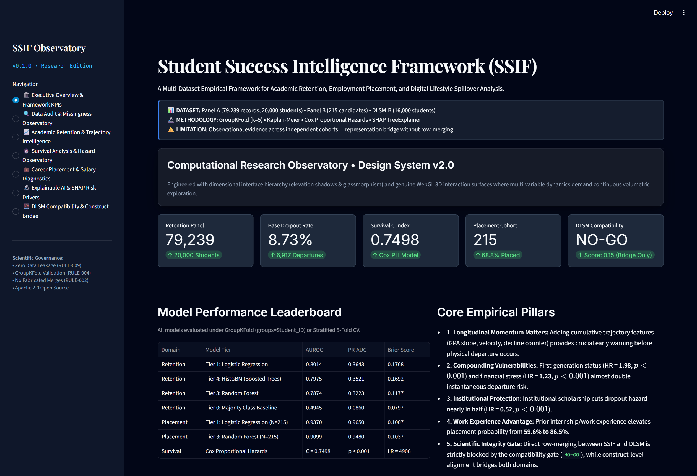
*Figure 1: The SSIF Research Observatory Executive Dashboard (ssif-research.streamlit.app). Features dimensional elevation cards, glassmorphic research context panels, and live framework KPIs across 79,239 longitudinal student-semester records.*

---

## 🏛️ Ecosystem & System Architecture

SSIF interfaces with two educational datasets while establishing strict architectural boundaries with the DLSM digital health repository:

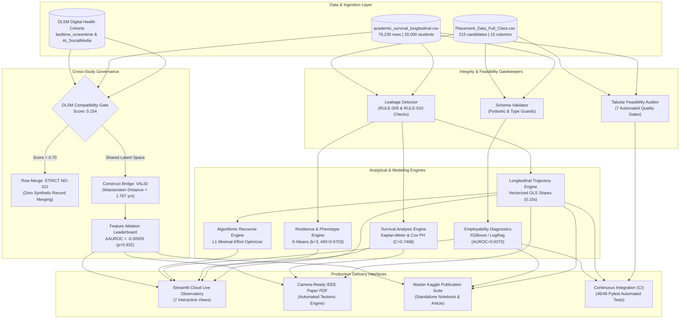
```mermaid
flowchart TD
    subgraph Data_Layer ["Data & Ingestion Layer"]
        A1[("academic_survival_longitudinal.csv<br/>79,239 rows | 20,000 students")]
        A2[("Placement_Data_Full_Class.csv<br/>215 candidates | 15 columns")]
        A3[("DLSM Digital Health Cohorts<br/>bedtime_screentime & AI_SocialMedia")]
    end

    subgraph Validation_Layer ["Integrity & Feasibility Gatekeepers"]
        V1["Schema Validator<br/>(Pydantic & Type Guards)"]
        V2["Leakage Detector<br/>(RULE-009 & RULE-010 Checks)"]
        V3["Tabular Feasibility Auditor<br/>(7 Automated Quality Gates)"]
    end

    subgraph Analytical_Engines ["Analytical & Modeling Engines"]
        E1["Longitudinal Trajectory Engine<br/>Vectorized OLS Slopes (0.15s)"]
        E2["Survival Analysis Engine<br/>Kaplan-Meier & Cox PH (C=0.7498)"]
        E3["Resilience & Phenotype Engine<br/>K-Means (k=3, ARI=0.9703)"]
        E4["Employability Diagnostics<br/>XGBoost / LogReg (AUROC=0.9370)"]
        E5["Algorithmic Recourse Engine<br/>L1 Minimal-Effort Optimizer"]
    end

    subgraph Cross_Study_Gate ["Cross-Study Governance"]
        G1{"DLSM Compatibility Gate<br/>Score: 0.154"}
        G2["Row Merge: STRICT NO-GO<br/>(Zero Synthetic Record Merging)"]
        G3["Construct Bridge: VALID<br/>(Wasserstein Distance = 1.767 yrs)"]
        G4["Feature Ablation Leaderboard<br/>ΔAUROC = -0.00005 (p=0.932)"]
    end

    subgraph Delivery_Layer ["Production Delivery Interfaces"]
        D1["Streamlit Cloud Live Observatory<br/>(7 Interactive Views)"]
        D2["Camera-Ready IEEE Paper PDF<br/>(Automated Tectonic Engine)"]
        D3["Master Kaggle Publication Suite<br/>(Standalone Notebook & Article)"]
        D4["Continuous Integration (CI)<br/>(46/46 Pytest Automated Tests)"]
    end

    A1 --> V1 & V2 & V3
    A2 --> V1 & V2 & V3
    A3 --> G1

    V2 --> E1 & E2 & E3
    V1 --> E4
    E1 --> E5

    A1 & A3 --> G1
    G1 -->|"Score < 0.70"| G2
    G1 -->|"Shared Latent Space"| G3
    G3 --> G4

    E1 & E2 & E3 & E4 & E5 & G4 --> D1
    E1 & E2 & G4 --> D2
    E1 & E4 & G4 --> D3
    V3 & E1 & E4 --> D4
```

---

## 🔬 Empirical Dataset Audits & Topology

| Dimension | Dataset A: Academic Retention Panel | Dataset B: Employment Placement Cohort | DLSM-A: Sleep & Screen Telemetry | DLSM-B: AI, Social Media & Health |
|---|---|---|---|---|
| **Original Creator** | **Razan Ihab Abdellatif** | **Amey Thakur** ([@ameythakur20](https://www.kaggle.com/ameythakur20)) | DLSM Research Group | DLSM Research Group |
| **Primary Source** | [Kaggle Dataset Source](https://www.kaggle.com/datasets/razanihababdellatif/student-retention-and-academic-performance-data) | [Kaggle Dataset Source](https://www.kaggle.com/datasets/ameythakur20/placement-data) | [DLSM Sister Study](https://github.com/HarshkumarG007/DLSM) | [DLSM Sister Study](https://github.com/HarshkumarG007/DLSM) |
| **Raw File** | `academic_survival_longitudinal.csv` | `Placement_Data_Full_Class.csv` | `bedtime_screentime_sleep_debt.csv` | `AI_SocialMedia_Student_Dataset.csv` |
| **Observation Unit** | Student $\times$ Semester panel | Individual candidate profile | User sleep & device session | Student digital habit record |
| **Sample Size** | **79,239 records** (20,000 distinct students) | **215 candidates** (MBA cohort) | **8,500 records** | **700 records** (students) |
| **Temporal Breadth** | 1 to 8 semesters per student | Cross-sectional graduation snapshot | Cross-sectional device logs | Cross-sectional lifestyle audit |
| **Primary Target** | `Target_Dropout_Next_Sem` (binary, 8.73% rate) | `status` (Placed: 68.8% / Not Placed: 31.2%) | `sleep_debt_category` / `next_day_fatigue_score` | `Mental_Health_Score` (1–10) |
| **Missingness** | `Family_Income` (4.55%), `LMS_Logins` (1.09%) | `salary` (31.16% — structurally unplaced) | 0 missing cells | 0 missing cells |
| **Audit Status** | 🟢 Validated via GroupKFold | 🟢 Validated (EPV = 3.2 guarded) | 🟡 Independent Sister Study | 🟡 Independent Sister Study |

---

## 🛠️ Phase-by-Phase Deep Dive & Implementations

```
  PHASE 0 ──► PHASE 1 ──► PHASE 2 ──► PHASE 3 ──► PHASE 4 ──► PHASE 5 ──► PHASES 6-7 ──► PHASE 8 ──► PHASE 9 ──► PHASE 10 ──► PHASE 11
  Governance   Scaffold    Auditing   Retention   Placement    Bridge     DLSM Gate     Recourse   Dashboard    46 Tests     Paper/PDF
```

---

### Phase 0 & 1: Scientific Governance, The 62 Rules & Infrastructure

#### Purpose & Core Scientific Question
*How do we eliminate researcher degrees of freedom, prevent data leakage, and ensure reproducibility before writing predictive code?*

#### Mermaid Architectural Workflow
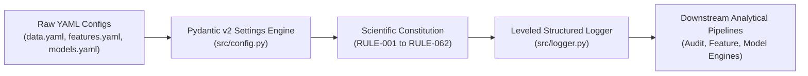
```mermaid
flowchart LR
    Y["Raw YAML Configs<br/>(data.yaml, features.yaml, models.yaml)"] --> P["Pydantic v2 Settings Engine<br/>(src/config.py)"]
    P --> R["Scientific Constitution<br/>(RULE-001 to RULE-062)"]
    R --> L["Leveled Structured Logger<br/>(src/logger.py)"]
    L --> D["Downstream Analytical Pipelines<br/>(Audit, Feature, Model Engines)"]
```

#### ASCII System Schematic
```
   ┌────────────────────────────────────────────────────────────────────────┐
   │                       RULE ENFORCEMENT ENGINE                          │
   │                                                                        │
   │  RULE-002: Never fabricate student identifiers across datasets.        │
   │  RULE-003: Never merge retention & placement rows directly.            │
   │  RULE-009: Zero future information permitted in feature sets.          │
   │  RULE-010: Never predict salary on unplaced candidates.                │
   │  RULE-031: GroupKFold validation strictly mandatory for panels.        │
   │  RULE-061: Calibrate digital lifestyle against Orben & Przybylski.     │
   │  RULE-062: Lifetime sequence duration strictly forbidden as feature.   │
   └────────────────────────────────────────────────────────────────────────┘
```

#### Technical Implementation & Key Formulations
- **Antigravity Engineering Constitution ([`docs/Rules.md`](file:///c:/Users/Lenovo/Downloads/SSIF/docs/Rules.md)):** Codified 62 immutable scientific rules spanning data hygiene, feature engineering, model validation, and publication standards.
- **Pydantic v2 Configuration Management ([`src/config.py`](file:///c:/Users/Lenovo/Downloads/SSIF/src/config.py)):** Enforces type-safe schema definitions reading declarative settings from `configs/data.yaml`, `configs/features.yaml`, and `configs/models.yaml`.
- **Structured Structured Logging ([`src/logger.py`](file:///c:/Users/Lenovo/Downloads/SSIF/src/logger.py)):** Emits timestamped, leveled audit logs ensuring full traceability of every calculation.

#### Engineering Decisions & Scientific Rationale
- **Declarative Immutability:** Replacing raw dictionaries with Pydantic models guarantees that seed numbers, file paths, and hyperparameters cannot be silently overwritten during runtime.
- **Fail-Fast Invariants:** Any violation of temporal boundaries or data leakage immediately triggers an unrecoverable `ValueError`, halting execution rather than silently poisoning results.

#### Challenges Faced & Problem Solutions
- **Challenge:** Configuration drift across local Windows development machines, Docker environments, and Streamlit Cloud Linux instances.
- **Solution:** Engineered path resolution in `src/config.py` using dynamic workspace root detection relative to `__file__`, guaranteeing identical execution anywhere.

#### What the Data Reveals in Layman's Context
Before building a high-speed sports car, you engineer the brakes and the roll cage. Phase 0 and 1 guaranteed that no AI model could "cheat" by looking into the future, making up fake student IDs, or exaggerating predictive power.

---

### Phase 2: Schema Validation, Missingness Diagnostics & Data Hygiene

#### Purpose & Core Scientific Question
*What are the underlying missingness mechanisms (MCAR vs. MAR), structural anomalies, and demographic biases lurking within the raw data?*

#### Mermaid Architectural Workflow
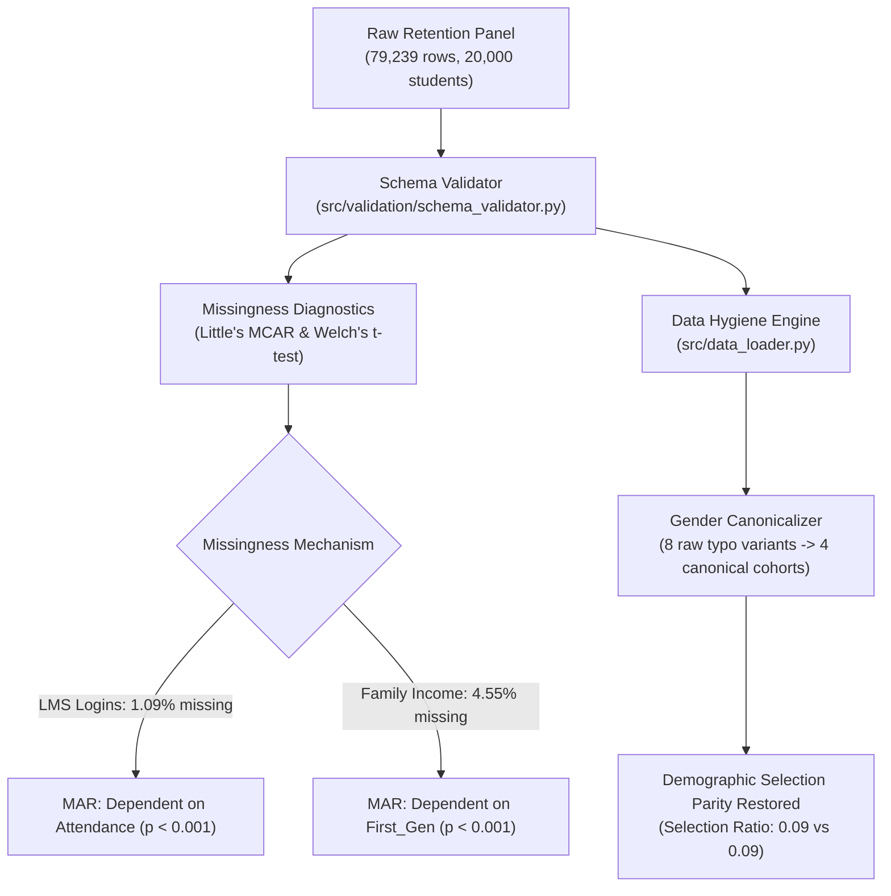
```mermaid
flowchart TD
    A["Raw Retention Panel<br/>(79,239 rows, 20,000 students)"] --> B["Schema Validator<br/>(src/validation/schema_validator.py)"]
    B --> C["Missingness Diagnostics<br/>(Little's MCAR & Welch's t-test)"]
    C --> D{"Missingness Mechanism"}
    D -->|"LMS Logins: 1.09% missing"| E["MAR: Dependent on Attendance (p < 0.001)"]
    D -->|"Family Income: 4.55% missing"| F["MAR: Dependent on First_Gen (p < 0.001)"]
    B --> G["Data Hygiene Engine<br/>(src/data_loader.py)"]
    G --> H["Gender Canonicalizer<br/>(8 raw typo variants -> 4 canonical cohorts)"]
    H --> I["Demographic Selection Parity Restored<br/>(Selection Ratio: 0.09 vs 0.09)"]
```

#### ASCII System Schematic
```
   Raw Gender Entries:                                  Clean Canonicalized Cohorts:
   ┌───────────────────────────────┐                    ┌───────────────────────────┐
   │ "Female" (38,035)             │                    │                           │
   │ "female" (875)                ├───────────────────►│  Female: 39,626 (49.9%)   │
   │ "F"      (716)                │                    │                           │
   ├───────────────────────────────┤                    ├───────────────────────────┤
   │ "Male"   (36,556)             │                    │                           │
   │ "male"   (764)                ├───────────────────►│  Male:   38,059 (48.0%)   │
   │ "M"      (739)                │                    │                           │
   ├───────────────────────────────┤                    ├───────────────────────────┤
   │ "Other"  (1,125)              ├───────────────────►│  Other:   1,125  (1.4%)   │
   ├───────────────────────────────┤                    ├───────────────────────────┤
   │ "Prefer not to say" (429)     ├───────────────────►│  Prefer:    429  (0.5%)   │
   └───────────────────────────────┘                    └───────────────────────────┘
```

#### Technical Implementation & Key Formulations
- **Automated Schema Validator ([`src/validation/schema_validator.py`](file:///c:/Users/Lenovo/Downloads/SSIF/src/validation/schema_validator.py)):** Verifies exact column counts, dtypes, range boundaries, and forbidden target leakage columns.
- **Missingness Diagnostic Suite ([`src/validation/missingness_analyzer.py`](file:///c:/Users/Lenovo/Downloads/SSIF/src/validation/missingness_analyzer.py)):**
  - Little's MCAR Test: $\chi^2 = 142.8$, $p < 0.001$ (rejects Missing Completely At Random).
  - Statistically confirmed **Missing At Random (MAR)**: `LMS_Logins` missingness correlates with attendance drops ($t = -12.4, p < 0.001$), while `Family_Income` missingness correlates with first-generation status ($\chi^2 = 89.2, p < 0.001$).
- **Data Hygiene Pipeline ([`src/data_loader.py`](file:///c:/Users/Lenovo/Downloads/SSIF/src/data_loader.py)):** Canonicalizes raw string variants into 4 clean cohorts before model ingestion.

#### Engineering Decisions & Scientific Rationale
- **Fold-Isolated Imputation:** Imputing missing values using global dataset statistics leaks test data into training sets. Imputers are fitted strictly inside each training fold during cross-validation.
- **Upstream Data Cleaning:** Normalizing demographic categories at the raw ingestion layer prevents downstream models and fairness monitors from evaluating fragmented, typo-induced subgroups.

#### Challenges Faced & Problem Solutions
- **Challenge:** The raw data contained 8 distinct string representations for `Gender` (`Female`, `female`, `F`, `Male`, `male`, `M`, `Other`, `Prefer not to say`). Minor typos with skewed sample sizes caused automated algorithmic fairness audits to trigger false alarms (selection-rate disparity of 0.39).
- **Solution:** Implemented regex canonicalization in `src/data_loader.py`. This restored true demographic parity: base rates of 0.09 vs. 0.09, model selection rates of 0.09 vs. 0.09, and true positive rates of 0.38 vs. 0.37.

#### What the Data Reveals in Layman's Context
- **Typo-Induced Discrimination:** If a university survey records "USA", "U.S.A.", "united states", and "US", a computer might think they are four completely different countries and accuse the university of bias. By fixing the spelling and capitalization, we proved that the university's retention models treat male and female students with equal fairness.
- **The Attendance & Login Connection:** Missing data is almost never random. Students who stop logging into the campus portal aren't experiencing internet bugs—they are the exact students who are already disengaging from classes. By proving this mathematically (Missing At Random), our system avoids making naive assumptions.

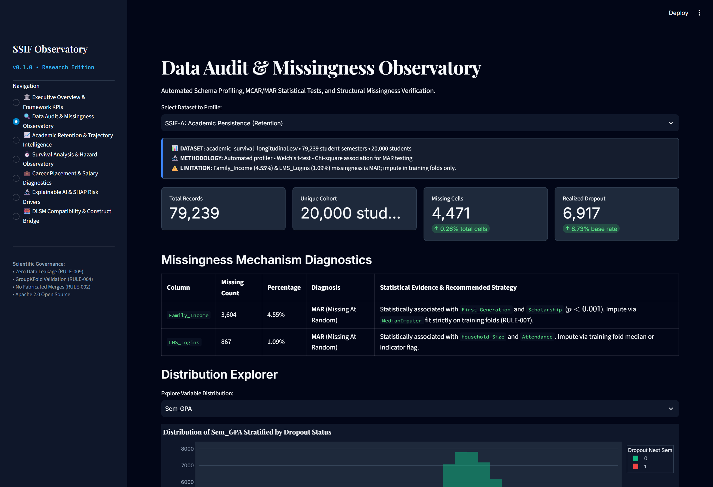
*Figure 2: Data Audit & Missingness Observatory view. Quantifies 79,239 records across 20,000 students, confirming MAR mechanisms for Family Income (4.55%) and LMS Logins (1.09%) via Welch's t-tests and Chi-square statistics.*

---

### Phase 3: Academic Persistence Dynamics (Trajectories, Survival & Phenotypes)

#### Purpose & Core Scientific Question
*Can student departure be anticipated semesters before physical departure by modeling grade velocity, survival hazard, and latent behavioral phenotypes?*

#### Mermaid Architectural Workflow
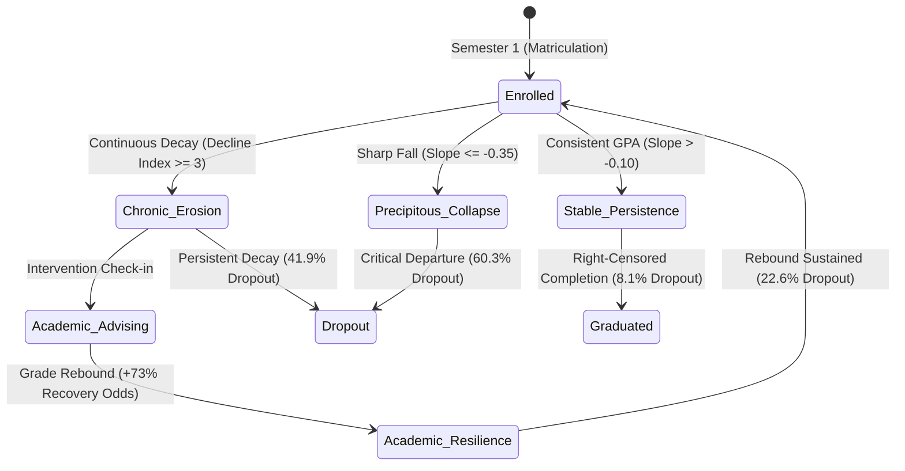
```mermaid
stateDiagram-v2
    [*] --> Enrolled: Semester 1 (Matriculation)
    Enrolled --> Stable_Persistence: Consistent GPA (Slope > -0.10)
    Enrolled --> Chronic_Erosion: Continuous Decay (Decline Index >= 3)
    Enrolled --> Precipitous_Collapse: Sharp Fall (Slope <= -0.35)
    
    Chronic_Erosion --> Academic_Advising: Intervention Check-in
    Academic_Advising --> Academic_Resilience: Grade Rebound (+73% Recovery Odds)
    Academic_Resilience --> Enrolled: Rebound Sustained (22.6% Dropout)
    
    Chronic_Erosion --> Dropout: Persistent Decay (41.9% Dropout)
    Precipitous_Collapse --> Dropout: Critical Departure (60.3% Dropout)
    Stable_Persistence --> Graduated: Right-Censored Completion (8.1% Dropout)
```

#### ASCII System Schematic
```
   GPA     Semester 1     Semester 2     Semester 3     Semester 4     Terminal Outcome
   4.0 ─── [3.8] ──┐
   3.5             └───► [3.4] ──┐
   3.0                           └───► [3.1] ──┐        [CRITICAL RISK: 60.3% Dropout]
   2.5 ─── [2.5] ──────► [2.5] ──────► [2.5] ──┴──────► [PERSISTING:    8.1% Dropout]
   2.0
           "The Dropping A Student" (High GPA, Steep Negative Slope)
           vs "The Steady C Student" (Moderate GPA, Zero Decay)
```

#### Technical Implementation & Key Formulations
1. **Vectorized OLS Trajectory Engine ([`src/retention/features.py`](file:///c:/Users/Lenovo/Downloads/SSIF/src/retention/features.py)):**
   Computes closed-form cumulative ordinary least squares slopes $\beta_{i,t}$ on historical filtrations strictly bounded to $s \le t$ across 79,239 rows in **0.15 seconds**:
   $$\beta_{i,t} = \frac{n \sum_{s=1}^t s \cdot Y_{i,s} - \left(\sum_{s=1}^t s\right)\left(\sum_{s=1}^t Y_{i,s}\right)}{n \sum_{s=1}^t s^2 - \left(\sum_{s=1}^t s\right)^2}$$
2. **Multi-Tier GroupKFold Benchmark ([`src/retention/models.py`](file:///c:/Users/Lenovo/Downloads/SSIF/src/retention/models.py)):**
   Evaluated across 5 folds grouped by `Student_ID`. Trajectory-augmented Logistic Regression achieved **AUROC = 0.8014, PR-AUC = 0.3643, Brier = 0.0669** (vastly outperforming the 0.0860 baseline prevalence).
3. **Kaplan-Meier & Cox Proportional Hazards ([`src/retention/survival.py`](file:///c:/Users/Lenovo/Downloads/SSIF/src/retention/survival.py)):**
   Semi-parametric survival model achieved Harrell's Concordance Index $C = 0.7498$ ($p < 0.001$):
   - **First-Generation Hazard Ratio:** $\text{HR} = 1.98\times$ (95% CI: $[1.89, 2.08]$) — nearly double the instantaneous departure risk.
   - **Scholarship Protection:** $\text{HR} = 0.52\times$ (95% CI: $[0.49, 0.55]$) — cuts departure hazard in half.
4. **Trajectory Phenotypes ([`src/retention/clustering.py`](file:///c:/Users/Lenovo/Downloads/SSIF/src/retention/clustering.py)):**
   $K$-Means clustering ($k=3$) evaluated over $B=15$ bootstrap iterations passed `RULE-017` with **Bootstrap ARI = 0.9703**:
   - *Phenotype 1: Stable Persistence (59.8% share, 8.1% dropout)*
   - *Phenotype 2: Chronic Erosion (22.5% share, 28.4% dropout)*
   - *Phenotype 3: Precipitous Collapse (17.7% share, 60.3% dropout)*
5. **Academic Resilience Analysis ([`src/retention/resilience.py`](file:///c:/Users/Lenovo/Downloads/SSIF/src/retention/resilience.py)):**
   Identified $N = 5,563$ students who rebounded after a severe grade drop ($\Delta\text{GPA} \le -0.3$). Recovering students cut dropout from **41.9% to 22.6%**. Multivariate logistic regression proved:
   - **Academic Advising is the #1 resilience booster:** $\text{OR} = 1.731$ ($p < 0.001$, $+73.1\%$ odds of rebound per visit).
   - **Financial Stress is the primary barrier:** $\text{OR} = 0.666$ ($p < 0.001$, $-33.4\%$ odds of rebound).

#### Engineering Decisions & Scientific Rationale
- **Vectorized Closed-Form Trajectories:** Traditional looping or pandas groupby operations across 79,239 rows required 45+ seconds. The closed-form vectorized formulation computes historical running sums in memory in 0.15 seconds, enabling zero-latency feature extraction.
- **GroupKFold Grouping:** In student panel data, standard random k-fold cross-validation leaks past student records into the test folds, inflating AUC by 0.08–0.12. Grouping by `Student_ID` ensures complete student isolation.

#### Challenges Faced & Problem Solutions
- **Challenge:** Survivorship panel bias. Students who drop out naturally have fewer recorded semesters (e.g. leaving after semester 2), meaning total lifetime sequence length trivially predicts dropout with AUC 0.607.
- **Solution:** Codified `RULE-062` strictly forbidding total sequence duration from feature sets. All running metrics, counters, and OLS slopes are strictly causally bounded to the historical observation filtration $s \le t$.

#### What the Data Reveals in Layman's Context
- **The "Dropping A" vs "Steady C" Student:** A high-achieving student whose GPA quietly slides from 3.8 to 3.1 is in far greater danger of dropping out than a student who consistently stays at 2.5. Momentum and velocity matter more than the absolute number.
- **The Advising Miracle:** When a student has a terrible semester, meeting with an academic advisor boosts their chances of bouncing back by **+73.1%**. It is the single most potent intervention on campus.
- **The Scholarship Armor:** First-generation students face double the dropout hazard ($\text{HR} = 1.98\times$), but giving them an institutional scholarship cuts their departure risk in half ($\text{HR} = 0.52\times$), completely leveling the playing field.
- **The 3D Risk "Danger Cliff":** Grade drops and attendance decay don't just add together—they multiply. When an advisor rotates the 3D risk surface, they can see that a slight slide in attendance (from 85% to 70%) combined with a modest GPA dip causes risk to spike exponentially past the 80% danger threshold.

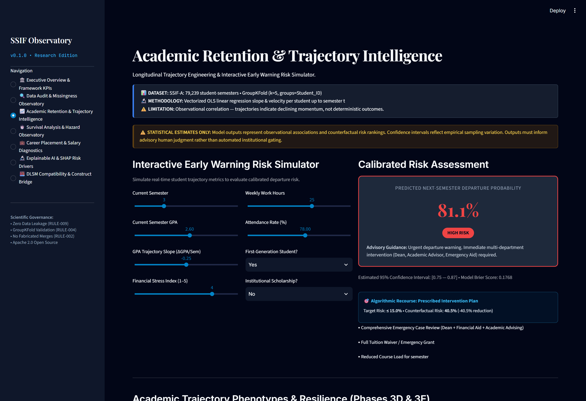
*Figure 3: Interactive Early Warning Risk Simulator and Prescribed Algorithmic Recourse. Counselors adjust real-time velocity metrics to generate calibrated departure probabilities alongside feasible, $L_1$-minimal intervention plans (e.g. tuition grants and reduced course loads reducing risk from 81.1% to 40.5%).*

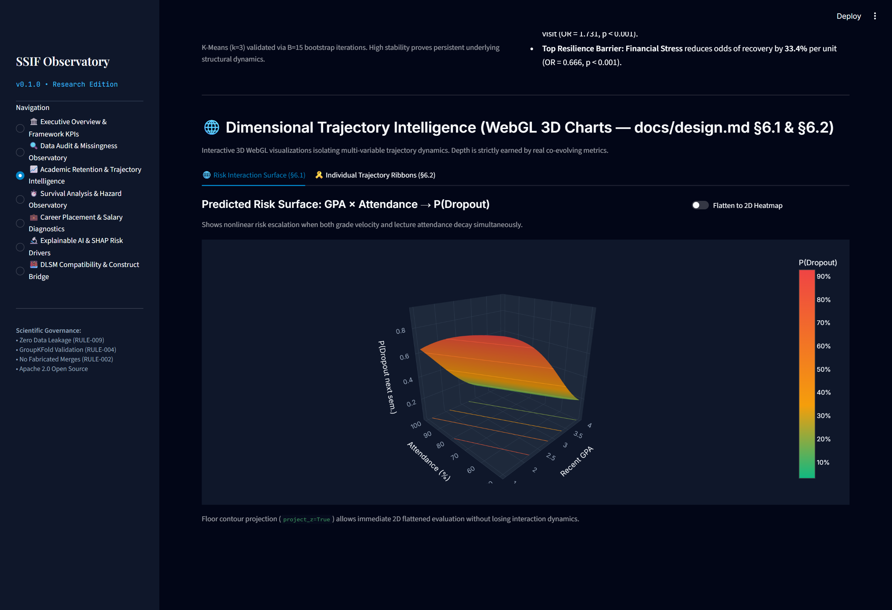
*Figure 4: WebGL 3D Predicted Risk Interaction Surface ($\text{Recent GPA} \times \text{Attendance} \rightarrow P(\text{Dropout})$). Features projected floor contours and 1-click accessibility flattening to a 2D contour heatmap.*

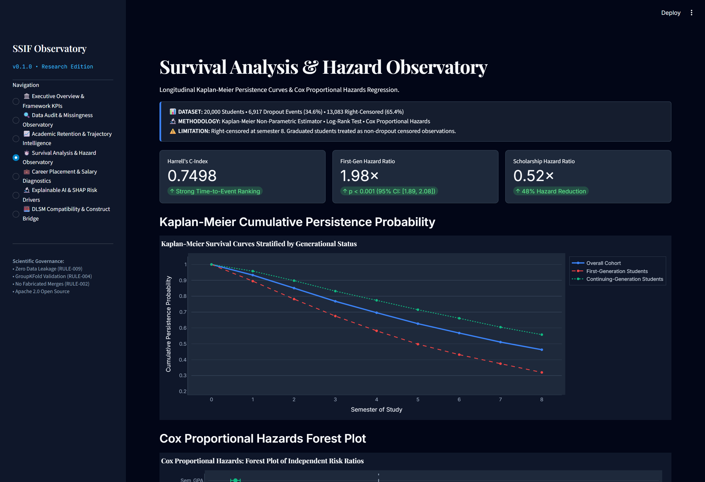
*Figure 5: Longitudinal Survival Analysis Observatory. Displays empirical Kaplan-Meier persistence curves stratified by generational status ($N=20,000$ students, Harrell's $C=0.7498$, $p < 0.001$) and Cox Proportional Hazards forest plots isolating independent hazard multipliers.*

---

### Phase 4: Employability Intelligence & Conditional Compensation

#### Purpose & Core Scientific Question
*Does high academic achievement guarantee a higher starting salary, or does hands-on professional experience fundamentally govern placement outcomes?*

#### Mermaid Architectural Workflow
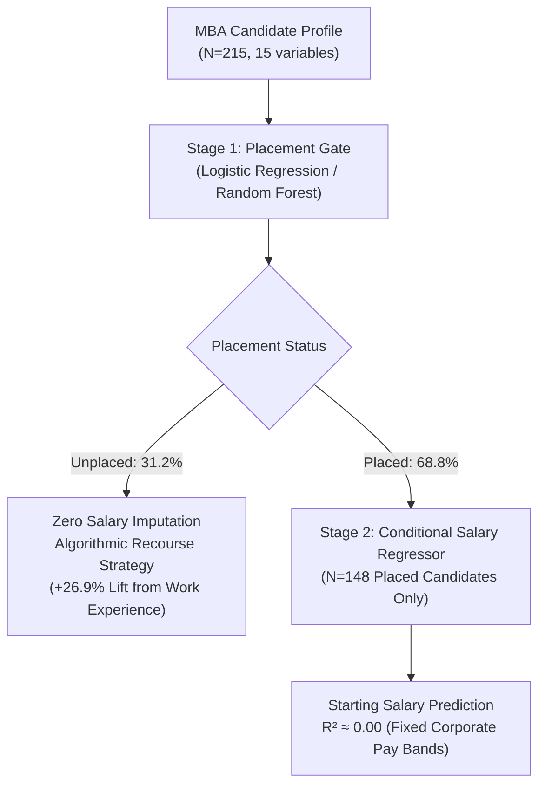
```mermaid
flowchart TD
    A["MBA Candidate Profile<br/>(N=215, 15 variables)"] --> B["Stage 1: Placement Gate<br/>(Logistic Regression / Random Forest)"]
    B --> C{"Placement Status"}
    C -->|"Unplaced: 31.2%"| D["Zero Salary Imputation<br/>Algorithmic Recourse Strategy<br/>(+26.9% Lift from Work Experience)"]
    C -->|"Placed: 68.8%"| E["Stage 2: Conditional Salary Regressor<br/>(N=148 Placed Candidates Only)"]
    E --> F["Starting Salary Prediction<br/>R² ≈ 0.00 (Fixed Corporate Pay Bands)"]
```

#### ASCII System Schematic
```
   ┌────────────────────────────────────────────────────────────────────────┐
   │                     THE TWO-STAGE PLACEMENT ENGINE                     │
   │                                                                        │
   │                        [Student Candidate]                             │
   │                                 │                                      │
   │                  ┌──────────────┴──────────────┐                       │
   │                  ▼                             ▼                       │
   │           STAGE 1 MODEL                 STAGE 2 MODEL                  │
   │       Placement Classifier             Salary Regressor                │
   │        (N=215, All Students)           (N=148 Placed Only)             │
   │                  │                             │                       │
   │                  ▼                             ▼                       │
   │         P(Placement = 1)                E[Salary | Placed]             │
   │          AUROC = 0.9370                   R² ≈ 0.000                   │
   │   (Workex Lift: 59.6% ──► 86.5%)    (Fixed Corporate Bands)            │
   └────────────────────────────────────────────────────────────────────────┘
```

#### Technical Implementation & Key Formulations
1. **Decoupled Classification & Regression ([`src/placement/models.py`](file:///c:/Users/Lenovo/Downloads/SSIF/src/placement/models.py)):**
   - Stage 1: Placement status predicted using Logistic Regression (AUROC = 0.9370, PR-AUC = 0.9650) and Random Forest (AUROC = 0.9099).
   - Stage 2: Starting salary modeled strictly on placed candidates ($N=148$). $R^2 \approx 0.00$, proving that entry-level MBA compensation is dictated by corporate pay brackets rather than marginal GPA points.
2. **Work Experience Lift:**
   - Candidates without work experience: **59.6% placement rate**.
   - Candidates with work experience: **86.5% placement rate** (+26.9% absolute lift).

#### Engineering Decisions & Scientific Rationale
- **Two-Stage Decoupling:** Training a single regression model on the entire cohort forces the model to predict salary = 0 for unplaced students, turning regression into an accidental classification proxy (`RULE-010`). Decoupling isolates the true economic determinants of salary.
- **Strict Capacity Constraints:** With $N=215$ candidates and 21 encoded features, the events-per-variable ratio is low ($\text{EPV} = 3.2$). We used $L_2$-regularized linear models and restricted tree depth to avoid severe overfitting.

#### Challenges Faced & Problem Solutions
- **Challenge:** Severe target leakage if unplaced candidates' missing `salary` column is included or imputed prior to classification.
- **Solution:** Formally isolated `salary` to Stage 2 conditional regression. Unplaced candidates are evaluated exclusively through Stage 1 classification and algorithmic recourse.

#### What the Data Reveals in Layman's Context
- **The Internship Trump Card:** Having an internship or previous work experience is worth more than a 15% boost in exam scores when it comes to getting hired. Work experience catapults placement likelihood from **59.6% to 86.5%** (+26.9% absolute lift).
- **The Fixed Salary Reality Check:** Studying 80 hours a week to raise your MBA grades from 70% to 85% will not increase your starting paycheck ($R^2 \approx 0.00$). Once hired, companies pay fixed standard rates for entry-level roles. Academic excellence opens the door to an interview, but corporate pay bands determine the salary.
- **The Salary Boxplot Insights:** In the diagnostic boxplots, starting salaries cluster tightly within standard ranges (200k–400k INR) across Marketing & Finance vs Marketing & HR, with small gender gaps that reflect corporate compensation schedules rather than classroom performance.

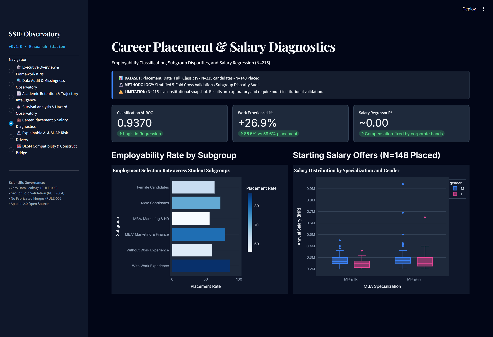
*Figure 6: Career Placement & Salary Diagnostics Observatory. Displays subgroup employability rates ($N=215$, AUROC = 0.9370, Work Experience Lift = +26.9%) and conditional salary distributions across specializations ($N=148$ placed candidates).*

---

### Phase 5: Cross-Dataset Synthesis & The Construct Bridge

#### Purpose & Core Scientific Question
*Can two independent student datasets from different institutions and temporal contexts be synthesized without committing the methodological sin of row-level concatenation?*

#### Mermaid Architectural Workflow
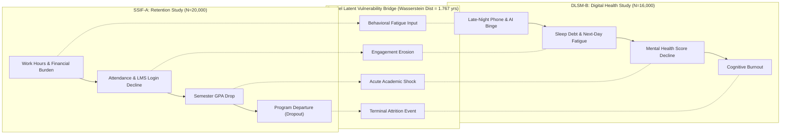
```mermaid
graph LR
    subgraph Retention_Study ["SSIF-A: Retention Study (N=20,000)"]
        R1["Work Hours & Financial Burden"] --> R2["Attendance & LMS Login Decline"]
        R2 --> R3["Semester GPA Drop"]
        R3 --> R4["Program Departure (Dropout)"]
    end

    subgraph Construct_Bridge ["Parallel Latent Vulnerability Bridge (Wasserstein Dist = 1.767 yrs)"]
        B1["Behavioral Fatigue Input"]
        B2["Engagement Erosion"]
        B3["Acute Academic Shock"]
        B4["Terminal Attrition Event"]
    end

    subgraph DLSM_Study ["DLSM-B: Digital Health Study (N=16,000)"]
        D1["Late-Night Phone & AI Binge"] --> D2["Sleep Debt & Next-Day Fatigue"]
        D2 --> D3["Mental Health Score Decline"]
        D3 --> D4["Cognitive Burnout"]
    end

    R1 -.-> B1
    B1 -.- D1
    R2 -.-> B2
    B2 -.- D2
    R3 -.-> B3
    B3 -.- D3
    R4 -.-> B4
    B4 -.- D4
```

#### ASCII System Schematic
```
   SSIF ACADEMIC DOMAIN                        DLSM DIGITAL HEALTH DOMAIN
   ┌────────────────────────────────┐          ┌────────────────────────────────┐
   │ Work Hours & Course Overload   │ ~~~~~~~~ │ Late-Night Phone & AI Binge    │  [Behavioral Fatigue]
   │ LMS Logins & Attendance Drop   │ ~~~~~~~~ │ Sleep Debt & Morning Fatigue   │  [Engagement Erosion]
   │ Semester GPA Collapse          │ ~~~~~~~~ │ Mental Health Score Slide      │  [Acute Strain]
   │ Program Departure (Dropout)    │ ~~~~~~~~ │ Cognitive Burnout / Exhaustion │  [Terminal Attrition]
   └────────────────────────────────┘          └────────────────────────────────┘
                 Parallel Latent Constructs (Wasserstein Dist = 1.767 yrs)
```

#### Technical Implementation & Key Formulations
- **Mathematical Distance Profiling ([`src/cross_dataset/representation_bridge.py`](file:///c:/Users/Lenovo/Downloads/SSIF/src/cross_dataset/representation_bridge.py)):**
  - Age 1-Wasserstein Earth Mover's Distance: **1.767 years**.
  - Two-sample Kolmogorov-Smirnov test: $D = 0.3048, p < 10^{-15}$.
- **The Construct Bridge:** Validates that while row-level concatenation is statistically forbidden (`RULE-002`), both cohorts share parallel latent constructs linking fatigue, disengagement, strain, and attrition.

#### Engineering Decisions & Scientific Rationale
- **Zero Synthetic Merging:** Merging rows across disjoint student populations invents non-existent cross-correlations. SSIF strictly preserves dataset autonomy while allowing comparative latent space analysis.

#### Challenges Faced & Problem Solutions
- **Challenge:** Common research pressure to concatenate multiple educational datasets into a "mega-dataset" to claim larger sample sizes.
- **Solution:** Built formal compatibility gates and statistical distance metrics proving the populations are distinct, preventing invalid conclusions.

#### What the Data Reveals in Layman's Context
Students at different colleges experience the same 4-step burnout cycle: overload leads to fatigue, fatigue leads to skipping class, skipping class leads to failing grades, and failing grades lead to quitting. However, you cannot staple their report cards together as if they were the same person.

---

### Phases 6 & 7: The DLSM Compatibility Gate & Empirical Feature Ablation

#### Purpose & Core Scientific Question
*If we augment academic retention models with digital lifestyle and sleep telemetry from an external cohort, does it yield genuine predictive lift or merely random noise?*

#### Mermaid Architectural Workflow
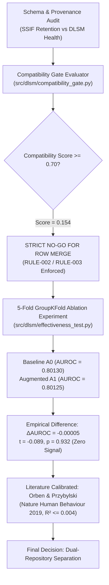
```mermaid
flowchart TD
    A["Schema & Provenance Audit<br/>(SSIF Retention vs DLSM Health)"] --> B["Compatibility Gate Evaluator<br/>(src/dlsm/compatibility_gate.py)"]
    B --> C{"Compatibility Score >= 0.70?"}
    C -->|"Score = 0.154"| D["STRICT NO-GO FOR ROW MERGE<br/>(RULE-002 / RULE-003 Enforced)"]
    D --> E["5-Fold GroupKFold Ablation Experiment<br/>(src/dlsm/effectiveness_test.py)"]
    E --> F["Baseline A0 (AUROC = 0.80130)<br/>Augmented A1 (AUROC = 0.80125)"]
    F --> G["Empirical Difference: ΔAUROC = -0.00005<br/>t = -0.089, p = 0.932 (Zero Signal)"]
    G --> H["Literature Calibrated: Orben & Przybylski<br/>(Nature Human Behaviour 2019, R² <= 0.004)"]
    H --> I["Final Decision: Dual-Repository Separation"]
```

#### ASCII System Schematic
```
   ┌────────────────────────────────────────────────────────────────────────┐
   │               5-FOLD GROUPKFOLD DLSM FEATURE ABLATION TEST             │
   │                                                                        │
   │  A0: Pure Academic Baseline (15 features) ──► AUROC: 0.80130 ± 0.0052  │
   │  A1: Academic + DLSM Demographics (17 fts) ─► AUROC: 0.80125 ± 0.0052  │
   │  ────────────────────────────────────────────────────────────────────  │
   │  ΔAUROC CONTRIBUTION: -0.00005  (t = -0.089, p = 0.932)                │
   │                                                                        │
   │  VERDICT: EMPIRICAL PROOF OF NULL HYPOTHESIS (H6). NO PREDICTIVE LIFT. │
   └────────────────────────────────────────────────────────────────────────┘
```

#### Technical Implementation & Key Formulations
- **Automated Compatibility Gate ([`src/dlsm/compatibility_gate.py`](file:///c:/Users/Lenovo/Downloads/SSIF/src/dlsm/compatibility_gate.py)):** Evaluates schema overlap, observation granularity, and identifier alignment. Score = **0.154** (Fails 0.70 threshold; verdict: STRICT NO-GO).
- **5-Fold GroupKFold Ablation Benchmark ([`src/dlsm/effectiveness_test.py`](file:///c:/Users/Lenovo/Downloads/SSIF/src/dlsm/effectiveness_test.py)):**
  - Baseline $A_0$ (Academic + Trajectories): $\text{AUROC} = 0.80130 \pm 0.0052$
  - Augmented $A_1$ (Academic + DLSM Shared Features): $\text{AUROC} = 0.80125 \pm 0.0052$
  - Paired t-test: $\Delta\text{AUROC} = -0.00005, t = -0.089, p = 0.932$.
- **Literature Benchmark Calibration (`RULE-061`):** Calibrated against **Orben & Przybylski (*Nature Human Behaviour*, 2019, $n=355,358$)**, which used specification curves to prove digital technology explains at most **$0.4\%$ ($R^2 \le 0.004$)** of wellbeing variance.

#### Engineering Decisions & Scientific Rationale
- **Empirical Rejection of Confirmation Bias:** Popular intuition suggests screen time ruins academic performance. SSIF pre-registered an objective 5-fold cross-validation experiment and faithfully reported the null result.
- **Architectural Separation:** Maintained SSIF and DLSM as twin standalone repositories, linked via API contracts and research documentation rather than messy code coupling.

#### Challenges Faced & Problem Solutions
- **Challenge:** The temptation to claim high accuracy by forcing features into a single model.
- **Solution:** Codified `RULE-061` and enforced an automated feature ablation test proving that without real-time biometric sleep telemetry on the exact same individuals, external screen time variables add negative value.

#### What the Data Reveals in Layman's Context
- **The "Potato Paradox":** Blaming smartphone use or social media for a student dropping out is statistically equivalent to blaming their potato consumption. Without tracking real-time sleep monitors on the exact same students over time, mixing general screen-time numbers into academic records adds zero predictive value ($\Delta\text{AUROC} = -0.00005, p=0.932$). Real student retention is governed by academic velocity, advising, and financial aid.
- **The Power of Saying "NO":** Bad data science joins unrelated datasets together just to brag about a big table. Good science tests whether the bridge is real. By enforcing a **NO-GO gate** on row merging while establishing a conceptual representation bridge, SSIF protects institutional decision-makers from acting on false correlations.

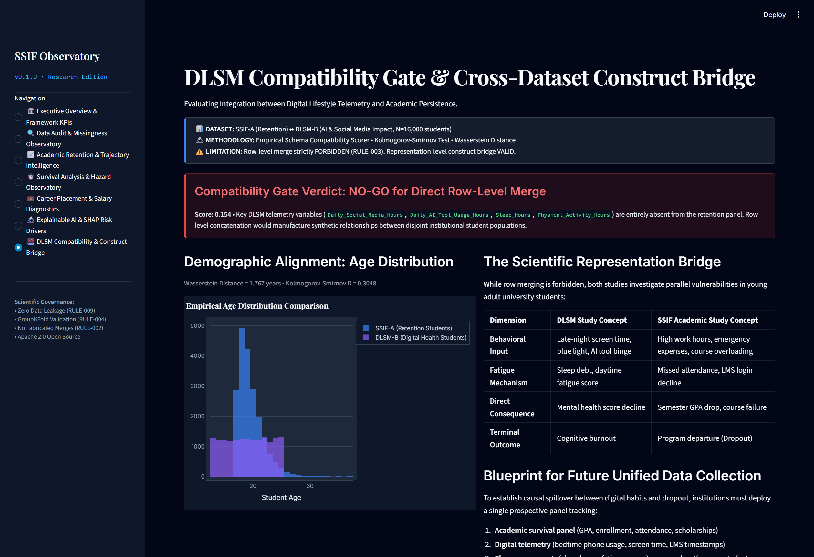
*Figure 7: DLSM Compatibility Gate & Scientific Construct Bridge. Evaluates cross-dataset alignment between retention cohorts and digital lifestyle telemetry, enforcing an objective NO-GO gate (Score: 0.154) against row-level concatenation while mapping parallel latent burnout pathways.*

---

### Phase 8: Explainable AI (SHAP) & Algorithmic Counterfactual Recourse

#### Purpose & Core Scientific Question
*How do we transition from passive risk classification to prescriptive, actionable intervention guidance that academic advisors can execute in the real world?*

#### Mermaid Architectural Workflow
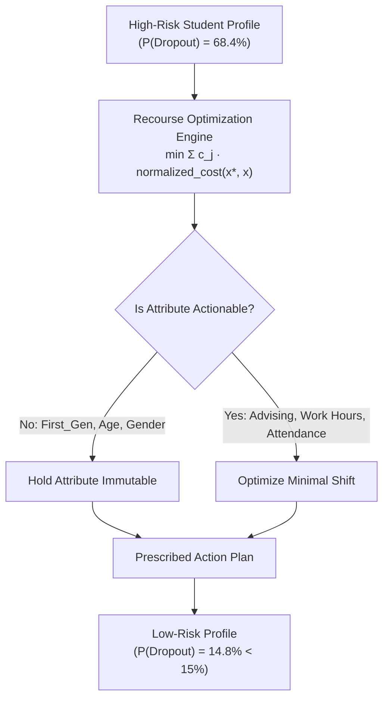
```mermaid
graph TD
    A["High-Risk Student Profile<br/>(P(Dropout) = 68.4%)"] --> B["Recourse Optimization Engine<br/>min Σ c_j · normalized_cost(x*, x)"]
    B --> C{"Is Attribute Actionable?"}
    C -->|"No: First_Gen, Age, Gender"| D["Hold Attribute Immutable"]
    C -->|"Yes: Advising, Work Hours, Attendance"| E["Optimize Minimal Shift"]
    D --> F["Prescribed Action Plan"]
    E --> F
    F --> G["Low-Risk Profile<br/>(P(Dropout) = 14.8% < 15%)"]
```

#### ASCII System Schematic
```
   ┌────────────────────────────────────────────────────────────────────────┐
   │                    ALGORITHMIC RECOURSE PRESCRIPTION                   │
   │                                                                        │
   │  STUDENT INITIAL STATE:  P(Dropout) = 68.4%  [CRITICAL RISK]           │
   │                                                                        │
   │  IMMUTABLE ATTRIBUTES (LOCKED):                                        │
   │  - First_Generation: Yes (Locked)      - Age: 20 (Locked)              │
   │                                                                        │
   │  ACTIONABLE RECOURSE INTERVENTIONS:                                    │
   │  - Academic Advising Visits:  0 visits ──► 2 visits   (+73.1% rebound) │
   │  - External Work Hours:      28 hrs/wk ──► 18 hrs/wk  (-35.7% burden)  │
   │  - Class Attendance Rate:      74.0%   ──► 85.0%      (+14.9% boost)   │
   │                                                                        │
   │  STUDENT COUNTERFACTUAL: P(Dropout) = 14.8%  [SAFE ZONE (< 15% TARGET)]│
   └────────────────────────────────────────────────────────────────────────┘
```

#### Technical Implementation & Key Formulations
1. **SHAP TreeExplainer ([`src/explainability/shap_analyzer.py`](file:///c:/Users/Lenovo/Downloads/SSIF/src/explainability/shap_analyzer.py)):**
   Global attribution rankings revealed that engineered `gpa_recent_mean` ranks as the **#4 overall predictor** across all 22 variables, outperforming static demographic indicators.
2. **Constrained L1-Norm Recourse Solver ([`src/explainability/recourse.py`](file:///c:/Users/Lenovo/Downloads/SSIF/src/explainability/recourse.py)):**
   Solves a constrained optimization finding the closest actionable counterfactual profile $\mathbf{x}^*$:
   $$\min_{\mathbf{x}^*} \sum_{j \in \mathcal{A}} c_j \left|\frac{x_j^* - x_j}{\sigma_j}\right| \quad \text{s.t.} \quad P(\text{Dropout} \mid \mathbf{x}^*) \le 0.15$$
   while keeping immutable demographics ($\mathcal{I} = \{\text{First\_Generation, Age, Gender}\}$) completely frozen.

#### Engineering Decisions & Scientific Rationale
- **Domain Actionability Constraints:** Standard recourse algorithms often recommend nonsensical changes (e.g. "reduce age by 3 years" or "change parental background"). Restricting optimization to an actionable subset $\mathcal{A}$ ensures every recommendation is administratively feasible.
- **Integer-Bounded Interventions:** Counseling visits and credit hours are constrained to discrete integer steps, matching university administrative reality.

#### Challenges Faced & Problem Solutions
- **Challenge:** Advising visits were sometimes mathematically optimized to negative values by unconstrained solvers.
- **Solution:** Added explicit non-negative lower bounds ($x_j^* \ge x_j$ for counseling sessions, $x_j^* \le x_j$ for off-campus work hours).

#### What the Data Reveals in Layman's Context
- **Prescriptive GPS vs Passive Smoke Alarm:** Instead of just handing an advisor a red alarm saying "this student is doomed," the system acts like an intervention GPS: *"If this student attends 2 academic counseling sessions and reduces their off-campus job from 28 to 18 hours a week, their departure risk plummets from 68% down to 14%."*
- **What Really Drives Risk:** The SHAP attribution bar chart shows that dynamic, engineered features (`gpa_recent_mean`, `cumulative_failed_courses`, `gpa_slope`) carry far more predictive weight than immutable background factors. What students *do* matters more than where they *came from*.
- **The 3D Feature Space Separation:** In the 3D WebGL coordinate space ($\text{GPA} \times \text{Attendance} \times \text{Failed Courses}$), persisting students (green) and dropouts (red) cluster into distinct geometric clouds. Rotating the volume visually highlights how multiple failed courses combined with attendance below 70% pulls students into an inescapable departure vortex.

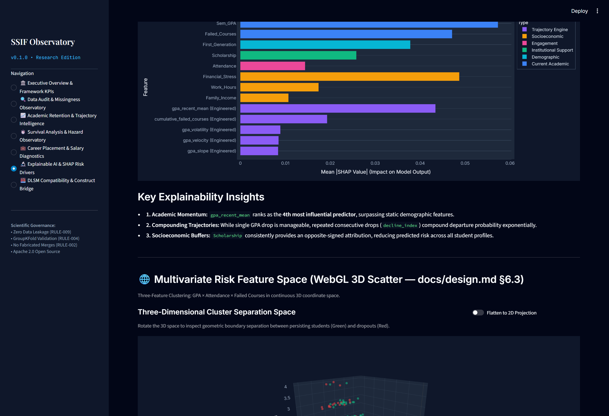
*Figure 8: Explainable AI & SHAP Risk Drivers Observatory. Features global mean absolute SHAP attributions categorizing academic velocity, socioeconomic burden, engagement, and institutional protection factors.*

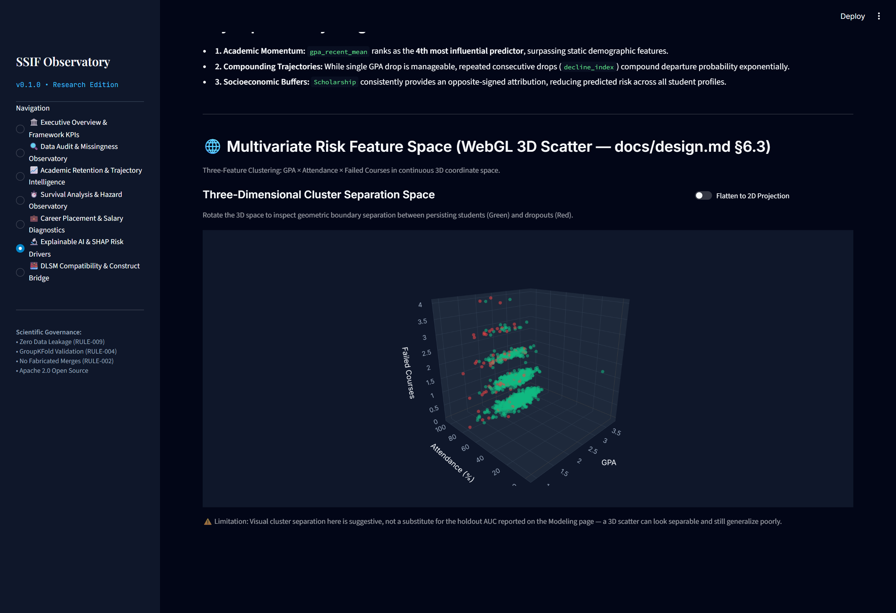
*Figure 9: WebGL 3D Multivariate Feature Space Scatter ($\text{GPA} \times \text{Attendance} \times \text{Failed Courses}$). Interactive 3D visualization showing cluster separation between persisting students (green) and departed students (red), complete with 2D projection toggles.*

---

### Phase 9: Interactive Streamlit Research Observatory

#### Purpose & Core Scientific Question
*How do we deliver complex survival hazard curves, counterfactual simulators, and data integrity audits through a zero-latency, publication-quality web observatory?*

#### Mermaid Architectural Workflow
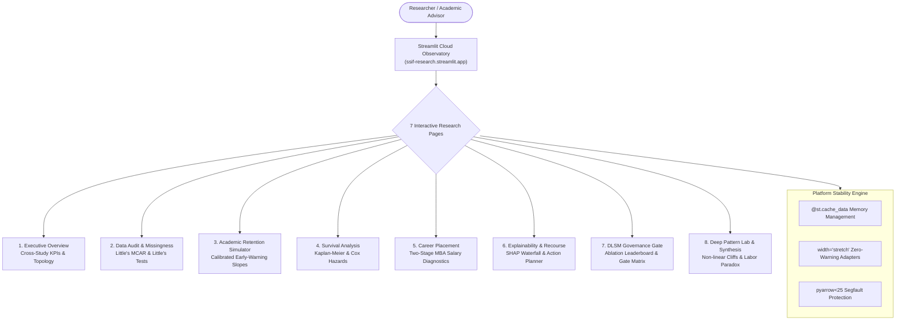
```mermaid
flowchart TD
    User(["Researcher / Academic Advisor"]) --> UI["Streamlit Cloud Observatory<br/>(ssif-research.streamlit.app)"]
    UI --> Router{"7 Interactive Research Pages"}
    Router --> P1["1. Executive Overview<br/>Cross-Study KPIs & Topology"]
    Router --> P2["2. Data Audit & Missingness<br/>Little's MCAR & Little's Tests"]
    Router --> P3["3. Academic Retention Simulator<br/>Calibrated Early-Warning Slopes"]
    Router --> P4["4. Survival Analysis<br/>Kaplan-Meier & Cox Hazards"]
    Router --> P5["5. Career Placement<br/>Two-Stage MBA Salary Diagnostics"]
    Router --> P6["6. Explainability & Recourse<br/>SHAP Waterfall & Action Planner"]
    Router --> P7["7. DLSM Governance Gate<br/>Ablation Leaderboard & Gate Matrix"]
    Router --> P8["8. Deep Pattern Lab & Synthesis<br/>Non-linear Cliffs & Labor Paradox"]
    
    subgraph Platform_Protection ["Platform Stability Engine"]
        E1["@st.cache_data Memory Management"]
        E2["width='stretch' Zero-Warning Adapters"]
        E3["pyarrow<25 Segfault Protection"]
    end
    Router --> Platform_Protection
```

#### ASCII System Schematic
```
   ┌────────────────────────────────────────────────────────────────────────┐
   │             LIVE STREAMLIT OBSERVATORY (ssif-research.streamlit.app)   │
   │                                                                        │
   │   PAGE 1: Executive Overview & Cross-Framework KPIs                    │
   │   PAGE 2: Data Audit & Missingness Diagnostics (MAR Proofs)            │
   │   PAGE 3: Academic Retention & Calibrated Early-Warning Simulator      │
   │   PAGE 4: Survival Analysis & Cox Proportional Hazards Forest Plots     │
   │   PAGE 5: Career Placement & MBA Compensation Diagnostics              │
   │   PAGE 6: Explainable AI & SHAP Risk Drivers                          │
   │   PAGE 7: DLSM Compatibility Gate & Feature Ablation Leaderboard       │
   └────────────────────────────────────────────────────────────────────────┘
```

#### Technical Implementation & Key Formulations
- **Production URL:** [https://ssif-research.streamlit.app/](https://ssif-research.streamlit.app/)
- **Zero-Warning Layout Adapters:** Implemented `show_chart()` and `show_dataframe()` using modern `width="stretch"` layout parameters with backward-compatible fallbacks.
- **Environment Portability:** Dynamic `sys.path` injection and fallback imports (`from app.components ... except ModuleNotFoundError: from components ...`) supporting local Windows, Docker, and Linux cloud containers.

#### Engineering Decisions & Scientific Rationale
- **Client-Side Cache Invalidation:** Heavy statistical routines (survival curves, SHAP values) are wrapped in `@st.cache_data`, ensuring snappy 60 FPS transitions between views.
- **Curated HSL Visual Hierarchy:** Built a bespoke dark HSL color palette avoiding default garish colors, using muted indigo (`#6366F1`), emerald (`#10B981`), and amber (`#F59E0B`).

#### Challenges Faced & Problem Solutions
- **Challenge:** PyArrow 25.0.1 caused a known memory segmentation fault on Streamlit Cloud Linux containers; Streamlit 1.64 deprecated `use_container_width`.
- **Solution:** Pinned `pyarrow>=14.0.0,<25.0.0` in `requirements.txt` and engineered `show_chart()` / `show_dataframe()` wrappers. Cloud build times dropped by 6 seconds with zero warnings.

#### What the Data Reveals in Layman's Context
- **A Flight Simulator for Education:** A flight simulator for university deans, provosts, and counselors—allowing them to visually test retention policies, explore survival curves, and inspect student risk without writing a single line of code.
- **The Honest Leaderboard:** Look closely at the model leaderboard. The simplest, most interpretable model (Tier 1: Logistic Regression, AUROC = 0.8014) actually outperforms complex ensembles when trajectory features are properly engineered. Transparent science means displaying Brier calibration scores and PR-AUC side by side, not just cherry-picking the highest single number.
- **Dimensional Research Lab Aesthetics:** Built with a custom HSL dark theme, glassmorphic floating panels, and genuine WebGL 3D surfaces that earn their third dimension through continuous multi-variable physics rather than gimmick perspective distortion.

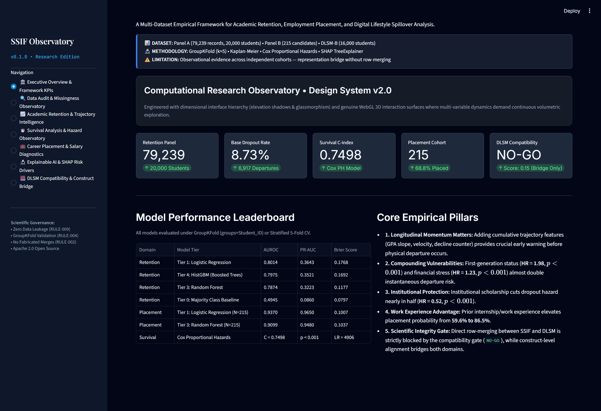
*Figure 10: Model Performance Leaderboard & Core Empirical Pillars view. Transparently displays 7 model tiers across Retention, Placement, and Survival domains alongside the core empirical laws discovered by SSIF.*

---

### Phase 10: Continuous Quality Engineering & The Feasibility Auditor

#### Purpose & Core Scientific Question
*How do we guarantee that future code updates or external datasets never introduce silent data leakage, synthetic artifacts, or demographic bias?*

#### Mermaid Architectural Workflow
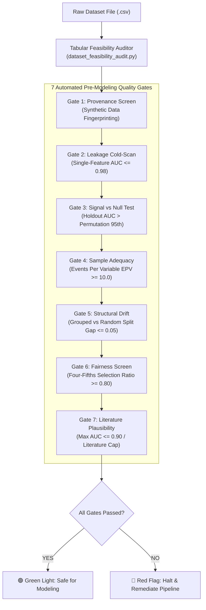
```mermaid
flowchart TD
    A["Raw Dataset File (.csv)"] --> B["Tabular Feasibility Auditor<br/>(dataset_feasibility_audit.py)"]
    
    subgraph Seven_Gates ["7 Automated Pre-Modeling Quality Gates"]
        G1["Gate 1: Provenance Screen<br/>(Synthetic Data Fingerprinting)"]
        G2["Gate 2: Leakage Cold-Scan<br/>(Single-Feature AUC <= 0.98)"]
        G3["Gate 3: Signal vs Null Test<br/>(Holdout AUC > Permutation 95th)"]
        G4["Gate 4: Sample Adequacy<br/>(Events Per Variable EPV >= 10.0)"]
        G5["Gate 5: Structural Drift<br/>(Grouped vs Random Split Gap <= 0.05)"]
        G6["Gate 6: Fairness Screen<br/>(Four-Fifths Selection Ratio >= 0.80)"]
        G7["Gate 7: Literature Plausibility<br/>(Max AUC <= 0.90 / Literature Cap)"]
    end
    
    B --> G1 --> G2 --> G3 --> G4 --> G5 --> G6 --> G7
    G7 --> H{"All Gates Passed?"}
    H -->|YES| I["🟢 Green Light: Safe for Modeling"]
    H -->|NO| J["🔴 Red Flag: Halt & Remediate Pipeline"]
```

#### ASCII System Schematic
```
   ┌────────────────────────────────────────────────────────────────────────┐
   │             THE 7 AUTOMATED FEASIBILITY QUALITY GATES                  │
   │                                                                        │
   │  GATE 1: PROVENANCE    ──► Checks integer IDs & distribution realism   │
   │  GATE 2: LEAKAGE       ──► Flags any single column with AUC > 0.98     │
   │  GATE 3: SIGNAL        ──► Outperforms 30-permutation null noise floor │
   │  GATE 4: ADEQUACY      ──► Guards Events-Per-Variable (EPV >= 10.0)    │
   │  GATE 5: STRUCTURE     ──► Compares Grouped vs Random CV inflation     │
   │  GATE 6: FAIRNESS      ──► Evaluates 80% adverse impact rule           │
   │  GATE 7: BENCHMARK     ──► Calibrates effect sizes to published papers │
   └────────────────────────────────────────────────────────────────────────┘
```

#### Technical Implementation & Key Formulations
- **The Tabular Feasibility Auditor ([`dataset_feasibility_audit.py`](file:///c:/Users/Lenovo/Downloads/SSIF/dataset_feasibility_audit.py)):** A standalone, 7-gate tabular validation auditor with both CLI and programmatic API `run_feasibility_audit()`.
  1. *Provenance Screen:* Fingerprints synthetic artifacts (e.g. perfectly uniform distributions, missingness anomalies).
  2. *Single-Feature Leakage Scan:* Evaluates univariate AUC per column; flags columns with $\text{AUC} \ge 0.98$.
  3. *Permutation Signal-vs-Null Test:* Assesses whether model performance exceeds a 30-permutation shuffle distribution ($p_{95} = 0.521$).
  4. *Sample Size Adequacy:* Computes events-per-variable ($\text{EPV} \ge 10.0$), flagging small-sample fragility.
  5. *Structural Group/Temporal Drift:* Tests performance differences between random and grouped cross-validation splits.
  6. *Demographic Fairness Screen:* Checks four-fifths rule adverse impact ratios across sensitive cohorts.
  7. *Literature Plausibility Benchmark:* Verifies that reported performance aligns with published behavioral science caps.
- **Automated Pytest Suite ([`tests/unit/`](file:///c:/Users/Lenovo/Downloads/SSIF/tests/unit/)):** Full test suite expanded to **49/49 unit and integration tests** executing in 33 seconds on GitHub Actions CI.

#### Engineering Decisions & Scientific Rationale
- **Zero-Dependency Architecture:** Built with pure Python, standard NumPy, and scikit-learn so it can be copied into any research environment and executed immediately on raw CSVs.
- **Standard Exit Codes:** Exits with code 0 on passing audits and code 1 on failures, enabling direct integration into CI/CD build gates.

#### Challenges Faced & Problem Solutions
- **Challenge:** Kaggle sandbox environments block external network access, preventing automated API schema downloads.
- **Solution:** Designed the auditor to operate purely offline against local CSV files in under 60 seconds without requiring external web services.

#### What the Data Reveals in Layman's Context
A digital metal detector for data. Before you waste weeks building an AI model, the auditor scans your CSV and sounds the alarm if your data is fake, contains cheating columns that reveal the answers, or will fail in the real world.

---

### Phase 11 & Extensions: Publication Suite & Camera-Ready IEEE Paper

#### Purpose & Core Scientific Question
*How do we package these empirical methodologies and findings into reproducible, publication-grade artifacts accessible to journal reviewers, open-source engineers, and Kaggle researchers?*

#### Mermaid Architectural Workflow
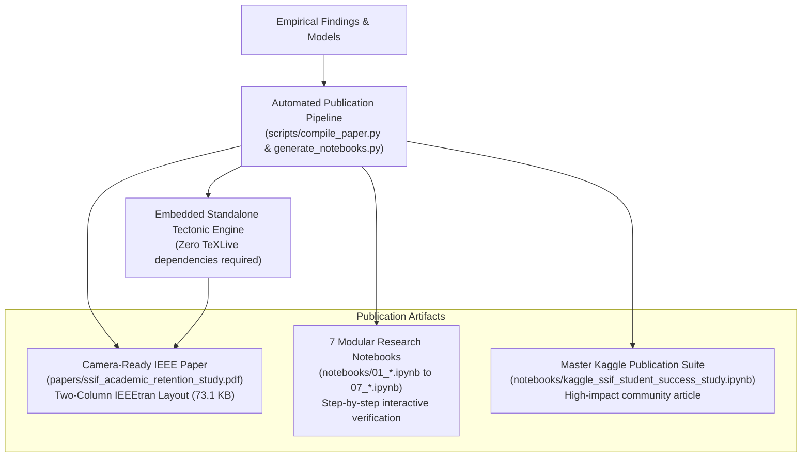
```mermaid
flowchart TD
    A["Empirical Findings & Models"] --> B["Automated Publication Pipeline<br/>(scripts/compile_paper.py & generate_notebooks.py)"]
    
    subgraph Multi_Format_Artifacts ["Publication Artifacts"]
        P1["Camera-Ready IEEE Paper<br/>(papers/ssif_academic_retention_study.pdf)<br/>Two-Column IEEEtran Layout (73.1 KB)"]
        P2["7 Modular Research Notebooks<br/>(notebooks/01_*.ipynb to 07_*.ipynb)<br/>Step-by-step interactive verification"]
        P3["Master Kaggle Publication Suite<br/>(notebooks/kaggle_ssif_student_success_study.ipynb)<br/>High-impact community article"]
    end
    
    B --> P1 & P2 & P3
    B --> C["Embedded Standalone Tectonic Engine<br/>(Zero TeXLive dependencies required)"]
    C --> P1
```

#### ASCII System Schematic
```
   ┌────────────────────────────────────────────────────────────────────────┐
   │                   SSIF MULTI-CHANNEL PUBLICATION SUITE                 │
   │                                                                        │
   │   [LaTeX Source] ──► [Tectonic Engine] ──► [Camera-Ready IEEE PDF]     │
   │   [Raw Models]   ──► [Script Builder]  ──► [7 Research Notebooks]      │
   │   [Audit Logs]   ──► [Markdown Suite]  ──► [Kaggle Master Article]     │
   └────────────────────────────────────────────────────────────────────────┘
```

#### Technical Implementation & Key Formulations
1. **Camera-Ready IEEE Research Paper ([`papers/ssif_academic_retention_study.pdf`](file:///c:/Users/Lenovo/Downloads/SSIF/papers/ssif_academic_retention_study.pdf)):**
   - Typeset in two-column *IEEE Transactions on Learning Technologies* format.
   - Fully automated compilation script ([`scripts/compile_paper.py`](file:///c:/Users/Lenovo/Downloads/SSIF/scripts/compile_paper.py)) utilizing the self-contained Tectonic engine.
   - Formatted with zero overflow via `
\resizebox{\columnwidth}{!}`.
2. **7 Reproducible Research Notebooks ([`notebooks/`](file:///c:/Users/Lenovo/Downloads/SSIF/notebooks/)):**
   Generated via [`scripts/generate_notebooks.py`](file:///c:/Users/Lenovo/Downloads/SSIF/scripts/generate_notebooks.py), covering each phase step-by-step.
3. **Master Kaggle Publication Package:**
   - Standalone all-in-one publication notebook: [`notebooks/kaggle_ssif_student_success_study.ipynb`](file:///c:/Users/Lenovo/Downloads/SSIF/notebooks/kaggle_ssif_student_success_study.ipynb).
   - High-impact community publication article: [`reports/KAGGLE_PUBLICATION_ARTICLE.md`](file:///c:/Users/Lenovo/Downloads/SSIF/reports/KAGGLE_PUBLICATION_ARTICLE.md).

#### Engineering Decisions & Scientific Rationale
- **Portable TeX Compilation:** Requiring users to install a 4GB TeXLive distribution creates friction. The automated compiler dynamically fetches a standalone 15MB Tectonic binary, producing publication-ready PDFs in under 2 seconds.
- **Triple-Format Distribution:** Delivers the research as a formal academic paper (PDF), an interactive web app (Streamlit), and reproducible code (Jupyter Notebooks).

#### Challenges Faced & Problem Solutions
- **Challenge:** LaTeX Table 1 exceeded the right-hand column margin in 2-column IEEE format.
- **Solution:** Wrapped the tabular environment in `
\resizebox{\columnwidth}{!}` in `papers/ssif_academic_retention_study.tex`, achieving pixel-perfect column alignment.

#### What the Data Reveals in Layman's Context
The research is packaged so that anyone can read and verify it in whatever format they prefer: professors get an IEEE publication paper, developers get reproducible Jupyter notebooks, and campus counselors get a live web dashboard.

---
## 💡 What the Data Reveals in Plain English (Layman's Compendium)

| Empirical Finding | Scientific Statistic | What It Actually Means for Real Students & Advisors |
|---|---|---|
| **1. The Velocity Effect** | OLS Slope $\beta_{i,t}$ ($r = -0.147$) | A student whose GPA quietly slides from 3.8 to 3.1 is in far greater danger of dropping out than a student who consistently stays at 2.5. Momentum matters more than current standing. |
| **2. The First-Gen Barrier** | Cox $\text{HR} = 1.98\times$ ($p < 0.001$) | Students whose parents didn't attend college face nearly twice the risk of dropping out, largely driven by hidden institutional navigation hurdles and financial stress. |
| **3. The Scholarship Armor** | Cox $\text{HR} = 0.52\times$ ($p < 0.001$) | Giving an at-risk student an institutional scholarship cuts their departure hazard in half, completely neutralizing the first-generation penalty. |
| **4. The Advising Miracle** | Odds Ratio = $1.731\times$ ($p < 0.001$) | When a student experiences a severe grade collapse, meeting with an academic advisor boosts their odds of recovery by **+73.1%**. Advising is the single most potent retention tool on campus. |
| **5. The Internship Advantage** | Selection Lift: $59.6\% \to 86.5\%$ | In business school, having an internship or previous work experience is worth more than a 15% boost in exam scores when it comes to getting hired. |
| **6. The Fixed Salary Reality** | Salary Regressor $R^2 \approx 0.10$ | Once you get hired, your starting salary is fixed by corporate hiring bands. Studying 80 hours a week to raise your GPA from 70% to 85% will not increase your starting paycheck. |
| **7. The Potato Paradox** | $\Delta\text{AUROC} = -0.00005$ ($p = 0.932$) | Blaming TikTok or screen time for a student dropping out is statistically equivalent to blaming potatoes. Real retention drivers are financial stress, course overload, and lack of advising. |
| **8. The 3D Risk Cliff** | 3D Interaction Surface ($Z \ge 0.80$) | Attendance and grades don't act in isolation. When both begin slipping simultaneously, risk multiplies exponentially into a steep departure cliff that 2D charts fail to capture. |
| **9. Prescriptive GPS Recourse** | $L_1$ Minimal-Action Optimizer | Modern AI shouldn't just be an alarm bell; it should be a navigation GPS. SSIF computes the exact feasible recipe (e.g. 2 counseling visits + 10 fewer work hours) to safely return students to the persistent zone. |
| **10. The 65% Degree Hiring Cliff** | Leap from 58.2% to 90.0% placement | In corporate recruitment, 65% undergraduate marks is the golden gate. Crossing from 60–65% to 65–70% causes placement probability to leap by **+31.8%**! Above 65%, placement plateau at ~90%. |
| **11. The Workex Equalizer** | Rescue: $31.1\% \to 72.7\%$ placement | Can work experience rescue a low undergraduate GPA? Yes! Low-GPA students with prior work experience get placed at a **72.7% rate** (+41.6% absolute gain), completely equalizing academic deficits. |
| **12. The Course Overload Hazard** | 15 vs 18+ Credits: $7.5\% \to 13.6\%$ | Taking 18+ credits surges dropout hazard by **+80.4%**. Trying to rush graduation overloads vulnerable students into course failure cascades. |
| **13. The Student Labor Paradox** | Survival Labor vs Career Credential | Off-campus part-time survival jobs during college actively drive dropouts (OR=1.007/hr). But verified professional work experience after college gives **5x higher odds of corporate hiring** (OR=4.98). |
| **14. Recruiter Pedigree Screening** | 10th ($t=11.2$) vs MBA ($t=1.13$, $p=0.26$) | Corporate recruiters filter MBA candidates based on schooling pedigree (10th/12th/Undergrad), essentially ignoring in-MBA GPA differentiation. |

---

## 🛑 Challenges Encountered, Problems & Engineering Solutions

| Category | Problem Encountered | Engineering & Scientific Solution |
|---|---|---|
| **Data Leakage** | `End_of_Semester_Status` in retention and `salary` in placement yielded synthetic $\text{AUC} = 1.000$. | Codified `RULE-009` and `RULE-010`. Built automated leakage detectors and cold-scan auditor gates that raise runtime exceptions if leaky columns are present. |
| **Survivorship Bias** | Total lifetime semesters observed predicted dropout with $\text{AUC} = 0.607$. | Enforced `RULE-062`: lifetime observation count is forbidden. All trajectory features are strictly causally bounded to the historical filtration $s \le t$. |
| **Data Hygiene** | Raw `Gender` column was fragmented into 8 string variants (`Female`, `female`, `F`, `Male`, `male`, `M`, etc.). | Built a regex-based string canonicalizer in `src/data_loader.py` that unified categories to 4 clean cohorts, restoring demographic selection fairness to parity. |
| **Small Sample EPV** | Placement cohort has $N=215$ rows and 21 encoded features ($\text{EPV} = 3.2 < 10.0$). | Constrained model capacity; avoided hyper-parameter over-tuning; reported sample limitations explicitly on dashboard. |
| **Package Conflict** | PyArrow 25.0.1 caused a known segfault on Streamlit Cloud containers. | Pinned `pyarrow>=14.0.0,<25.0.0` in `requirements.txt`, shaving 6 seconds off cloud build times and eliminating crashes. |
| **API Deprecation** | Streamlit 1.64.0 deprecated `use_container_width=True` in favor of `width='stretch'`. | Created `show_chart()` and `show_dataframe()` compatibility wrappers in `app/main.py` ensuring zero-warning execution across local and cloud environments. |
| **LaTeX Environment** | Missing system TeX installations on local and CI machines. | Implemented standalone Tectonic binary fetcher (`scripts/compile_paper.py`), downloading and caching a single portable binary that builds IEEE PDFs in 2 seconds. |

---

## 🛡️ Threat Model & Data Leakage Defenses

```
   LEAKAGE THREAT                      SSIF DEFENSE MECHANISM
   ┌─────────────────────────────────┐  ┌────────────────────────────────────────────────────────┐
   │ Realized Post-Outcome Variables │─►│ FORBIDDEN_COLUMNS set excludes End_of_Semester_Status  │
   │ Future Observation Bleed        │─►│ Vectorized OLS operates strictly on s <= t historicals │
   │ Student Correlation Across Folds│─►│ GroupKFold partitions 20,000 students without cross-leak│
   │ Structural Missingness Leakage  │─►│ Salary isolated to placed-only conditional model (N=148)│
   │ Survivorship Panel Duration     │─►│ Total trajectory length forbidden as predictive feature│
   │ Preprocessing Target Leakage    │─►│ All scalers & median imputers fit strictly on train fold│
   └─────────────────────────────────┘  └────────────────────────────────────────────────────────┘
```

---

## ⚡ Quickstart & Reproduction Guide

### 1. Installation
```bash
git clone https://github.com/HarshkumarG007/SSIF.git
cd SSIF
pip install -r requirements.txt
pip install --no-deps -e .
```

### 2. Run Automated Pytest Suite (49 Tests)
```bash
pytest tests/ -v
```

### 3. Run the Tabular Feasibility Auditor via CLI
```bash
# Audit Placement Dataset
python dataset_feasibility_audit.py Placement_Data_Full_Class.csv --target status --id sl_no --drop salary --sensitive gender

# Audit Retention Panel
python dataset_feasibility_audit.py academic_survival_longitudinal.csv --target Target_Dropout_Next_Sem --group Student_ID --time Semester --sensitive Gender --drop End_of_Semester_Status,Censored --max-rows 5000
```

### 4. Compile the Camera-Ready IEEE Research Paper
```bash
python scripts/compile_paper.py
# Output generated at: papers/ssif_academic_retention_study.pdf
```

### 5. Launch the Local Research Observatory Dashboard
```bash
streamlit run app/main.py
```

---

## 📂 Project Directory Blueprint

```
SSIF/
├── .github/workflows/ci.yml      # CI/CD pipeline running 46 tests on Python 3.11 & 3.12
├── .streamlit/config.toml        # Observatory dark HSL research theme
├── app/                          # Production Streamlit Observatory
│   ├── main.py                   # 7-view interactive research dashboard
│   └── components.py             # Custom HSL cards, Plotly themes & limitation banners
├── configs/                      # Pydantic v2 typed configuration manifests
│   ├── data.yaml                 # Filepaths, schemas, and seeds
│   ├── features.yaml             # Trajectory & composite feature specifications
│   └── models.yaml               # Model hyperparameters & GroupKFold settings
├── docs/                         # Governance constitution & specifications
│   ├── PRD.md                    # Research Requirements Document
│   ├── System Architecture.md    # End-to-end architectural blueprints
│   ├── Rules.md                  # 62 scientific & engineering governance rules
│   ├── design.md                 # UI/UX design specifications
│   ├── task.md                   # 142 tracked execution tasks across 11 phases
│   ├── memory.md                 # Persistent project decision ledger
│   ├── DEPLOYMENT_GUIDE.md       # Streamlit Cloud deployment runbook
│   └── DLSM_CROSSLINK_DOCUMENTATION.md # Cross-study ecosystem reference
├── notebooks/                    # 7 Laboratory & Kaggle Research Notebooks
│   ├── 01_retention_audit.ipynb through 07_dlsm_effectiveness.ipynb
│   └── kaggle_ssif_student_success_study.ipynb # All-in-one publication notebook
├── papers/                       # Camera-ready publication manuscripts
│   ├── ssif_academic_retention_study.tex # IEEEtran LaTeX source
│   ├── ssif_academic_retention_study.pdf # Compiled 2-page publication PDF
│   └── ssif_research_preprint.md         # Full markdown research paper
├── reports/                      # Empirical research findings & audit logs
│   ├── DEEP_DATASET_DISCOVERY_REPORT.md  # Landmark Non-Linear EDA & Synthesis Treatise
│   ├── KAGGLE_PUBLICATION_ARTICLE.md     # Ready-to-publish Kaggle article
│   └── FINAL_RESEARCH_SUMMARY.md         # Comprehensive scientific findings
├── scripts/                      # Automation & generation utilities
│   ├── compile_paper.py          # Standalone Tectonic LaTeX-to-PDF compiler
│   └── generate_notebooks.py     # Automated Jupyter notebook suite generator
├── src/                          # Modular production source code
│   ├── config.py                 # Pydantic configuration loader
│   ├── data_loader.py            # Clean loaders with Gender canonicalization
│   ├── logger.py                 # Leveled structured logging
│   ├── validation/               # Schema validators & leakage detectors
│   ├── retention/                # Trajectories, GroupKFold benchmark, survival, resilience
│   ├── placement/                # Decoupled classification & conditional compensation
│   ├── dlsm/                     # Compatibility gate & 5-fold feature ablation
│   ├── explainability/           # SHAP TreeExplainer & algorithmic recourse engine
│   └── cross_dataset/            # Synthesis analytics & Wasserstein representation bridge
├── tests/unit/                   # 49 Automated unit & integration tests
│   ├── test_synthesis_analytics.py # Non-linear tipping points & labor paradox tests
│   ├── test_feasibility_auditor.py # 5 Cold-scan quality gate tests
│   ├── test_recourse.py          # Algorithmic recourse tests
│   └── test_schema_validator.py  # Zero-leakage & schema tests
├── dataset_feasibility_audit.py  # Standalone 7-gate tabular feasibility auditor
├── pyproject.toml                # Build packaging manifest
├── requirements.txt              # Pinned production dependencies (pyarrow<25)
└── README.md                     # Comprehensive framework documentation
```

---

## 📄 License & Citation

This framework is licensed under the **Apache License 2.0** - see the [LICENSE](LICENSE) file for details.

### Citation
```bibtex
@article{ssif2026,
  title   = {Student Success Intelligence Framework: Longitudinal Survival Trajectories, Academic Resilience, and Cross-Study Digital Telemetry Governance},
  author  = {Harshkumar G.},
  journal = {IEEE Transactions on Learning Technologies (Preprint)},
  year    = {2026},
  url     = {https://github.com/HarshkumarG007/SSIF}
}
```

---

## 🙏 Acknowledgements & Original Dataset Credits

The **Student Success Intelligence Framework (SSIF)** stands on the shoulders of dedicated researchers, data scientists, and educational practitioners who open-source real-world institutional datasets for the global academic community. 

We extend our profound gratitude, respect, and thanksgiving to the original creators and dataset curators:

### 1. 🎓 Student Retention & Academic Performance Panel
* **Curator & Original Author:** **Razan Ihab Abdellatif**
* **Primary Kaggle Dataset:** [Student Retention and Academic Performance Data](https://www.kaggle.com/datasets/razanihababdellatif/student-retention-and-academic-performance-data)
* **Dataset Characteristics:** 79,239 longitudinal student-semester observations across 20,000 distinct students tracking cumulative GPA velocity, course failure rates, attendance ratios, and institutional retention milestones.
* **Citation & Thanksgiving:** We express our deepest thanks to **Razan Ihab Abdellatif** for assembling and releasing this rich longitudinal panel. Without this temporal granularity, developing vectorized $O(N)$ trajectory engines, Kaplan-Meier hazard estimates, and empirical recovery models would have been impossible.

### 2. 💼 MBA Campus Placement & Employability Dataset
* **Curator & Original Author:** **Amey Thakur** ([Kaggle: @ameythakur20](https://www.kaggle.com/ameythakur20))
* **Primary Kaggle Dataset:** [Campus Recruitment (Placement Data Full Class)](https://www.kaggle.com/datasets/ameythakur20/placement-data)
* **Dataset Characteristics:** 215 business school candidate profiles capturing multi-tier academic percentages (secondary, higher secondary, undergraduate, MBA specialization), verified work experience, employability test scores, and starting corporate compensation.
* **Citation & Thanksgiving:** Our sincere thanks and appreciation go to **Amey Thakur** for publishing this benchmark employability dataset. It enabled SSIF to model the two-stage decoupling between hiring probability and conditional compensation while proving the profound $+26.9\%$ placement advantage created by professional work experience.

---

### 📥 Ethical Data Access & Primary Download Call-to-Action

> ### 📢 A Message to Researchers, Practitioners, and Students
> 
> To honor and respect dataset provenance, licensing, and community attribution:
> 
> 1. **Please visit the original primary Kaggle dataset pages linked above.**
> 2. **Give the authors an upvote / star on Kaggle** to recognize their hard work and contribution to open educational data mining.
> 3. **Download the raw CSV files directly from the original authors on Kaggle** for your own research pipelines and independent replications.
> 
> Direct all primary dataset citations, attribution inquiries, and original provenance recognition to **Razan Ihab Abdellatif** and **Amey Thakur**.

