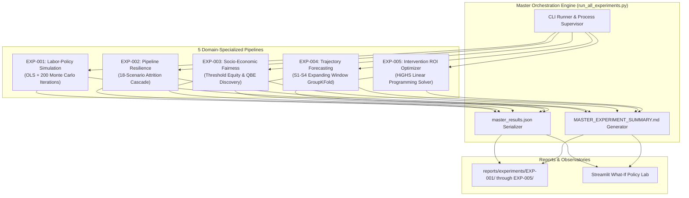

# System Architecture.md
# Student Success Intelligence Framework (SSIF)

**Version:** 2.0  
**Date:** 2026-09-29  
**Status:** Production Release & Research Experiments Architecture  
**Governed by:** PRD.md Section 8 (Functional Requirements)

---

## 0. Architecture Principle

```
EMPIRICAL FIRST
     ↓
DATA ISOLATION (Retention ≠ Placement — never row-merged)
     ↓
MODULAR PIPELINES (each domain independently traceable)
     ↓
EVIDENCE AGGREGATION (representation-level, not population-level merge)
     ↓
EXPLAINABLE OUTPUT
```

---

## 1. High-Level System Diagram

```
┌─────────────────────────────────────────────────────────────────┐
│                     RAW DATA LAYER                              │
│                                                                 │
│  academic_survival_longitudinal.csv   Placement_Data_Full_Class.csv │
│  (79,239 rows, 20,000 students)      (215 rows, cross-sectional)    │
│                ↓                              ↓                 │
│         [DLSM system — independent, no bridge to above]         │
└────────────────────────────────┬────────────────────────────────┘
                                 │
┌────────────────────────────────▼────────────────────────────────┐
│                   DATA VALIDATION LAYER                         │
│                                                                 │
│  src/validation/schema_validator.py                             │
│  src/validation/leakage_detector.py                             │
│  src/validation/missingness_analyzer.py                         │
│  src/validation/data_profiler.py                                │
└────────────────────────────────┬────────────────────────────────┘
                                 │
          ┌──────────────────────┼──────────────────────┐
          │                      │                      │
          ▼                      ▼                      ▼
┌─────────────────┐   ┌──────────────────┐   ┌──────────────────┐
│  RETENTION      │   │  PLACEMENT       │   │  DLSM ADAPTER    │
│  PIPELINE       │   │  PIPELINE        │   │  (compatibility  │
│                 │   │                  │   │   gate only)     │
│  src/retention/ │   │  src/placement/  │   │  src/dlsm/       │
└────────┬────────┘   └────────┬─────────┘   └────────┬─────────┘
         │                     │                      │
         ▼                     ▼                      ▼
┌─────────────────┐   ┌──────────────────┐   ┌──────────────────┐
│  FEATURES       │   │  FEATURES        │   │  COMPATIBILITY   │
│  - Trajectory   │   │  - Academic prep │   │  MATRIX          │
│  - Survival     │   │  - Work exp      │   │  (NO-GO verdict  │
│  - Resilience   │   │  - Specialisation│   │   documented)    │
└────────┬────────┘   └────────┬─────────┘   └────────┬─────────┘
         │                     │                      │
         ▼                     ▼                      ▼
┌─────────────────┐   ┌──────────────────┐   ┌──────────────────┐
│  MODELS         │   │  MODELS          │   │  EFFECTIVENESS   │
│  - Logistic     │   │  - Logistic      │   │  EXPERIMENT      │
│  - RF           │   │  - RF            │   │  (ablation —     │
│  - XGBoost      │   │  - XGBoost       │   │   will show      │
│  - Survival     │   │  - GAM           │   │   NO incremental │
│                 │   │  - Salary Reg    │   │   value)         │
└────────┬────────┘   └────────┬─────────┘   └──────────────────┘
         │                     │
         ▼                     ▼
┌──────────────────────────────────────────────────────┐
│              CROSS-DATASET ANALYSIS                  │
│                                                      │
│  src/cross_dataset/                                  │
│  - Representation comparison (no row merge)          │
│  - Latent dimension comparison                       │
│  - Feature importance comparison                     │
│  - Standardized effect comparison                    │
└──────────────────────┬───────────────────────────────┘
                       │
          ┌────────────┼────────────┐
          ▼            ▼            ▼
┌──────────────┐ ┌───────────┐ ┌──────────────┐
│  EXPLAINABILITY│ │STATISTICS │ │  MLFLOW      │
│  src/xai/    │ │ src/stats/│ │  TRACKING    │
│  - SHAP      │ │ - CI      │ │  experiments/│
│  - PDP/ICE   │ │ - Effects │ │              │
│  - Perm. imp.│ │ - Survival│ │              │
└──────────────┘ └───────────┘ └──────────────┘
                       │
                       ▼
         ┌─────────────────────────┐
         │   STREAMLIT DASHBOARD   │
         │   app/dashboard.py      │
         │   9 pages               │
         └─────────────────────────┘
```

---

## 2. Repository Structure

```
student-success-intelligence/  (SSIF root at c:\Users\Lenovo\Downloads\SSIF\)
│
├── academic_survival_longitudinal.csv   ← Dataset A (do not move)
├── Placement_Data_Full_Class.csv        ← Dataset B (do not move)
│
├── data/
│   ├── raw/            ← Symlinks or copies of original CSVs
│   ├── interim/        ← Intermediate cleaned versions
│   └── processed/      ← Feature-engineered outputs
│
├── docs/
│   ├── PRD.md
│   ├── System Architecture.md
│   ├── Rules.md
│   ├── design.md
│   ├── task.md
│   └── memory.md
│
├── src/
│   ├── __init__.py
│   ├── config.py               ← Loads configs/
│   │
│   ├── validation/
│   │   ├── __init__.py
│   │   ├── schema_validator.py
│   │   ├── leakage_detector.py
│   │   ├── missingness_analyzer.py
│   │   └── data_profiler.py
│   │
│   ├── retention/
│   │   ├── __init__.py
│   │   ├── loader.py
│   │   ├── features.py          ← Trajectory, slope, velocity, volatility
│   │   ├── clustering.py        ← Academic trajectory clusters
│   │   ├── models.py            ← Baseline → RF → XGBoost
│   │   ├── survival.py          ← KM + Cox + RSF
│   │   └── resilience.py        ← Recovery pattern analysis
│   │
│   ├── placement/
│   │   ├── __init__.py
│   │   ├── loader.py
│   │   ├── features.py
│   │   ├── models.py            ← Classification (placed/not placed)
│   │   ├── salary.py            ← Conditional salary regression (N=148)
│   │   └── phenotypes.py        ← Employability clustering
│   │
│   ├── cross_dataset/
│   │   ├── __init__.py
│   │   ├── representation.py    ← PCA/FA on each dataset independently
│   │   ├── comparison.py        ← Standardized effect comparison
│   │   └── correspondence.py    ← Feature mapping between domains
│   │
│   ├── dlsm/
│   │   ├── __init__.py
│   │   ├── compatibility_gate.py   ← Variable matching matrix
│   │   ├── effectiveness_test.py   ← Ablation (will confirm NO-GO)
│   │   └── adapter.py              ← Future: bridge if new data collected
│   │
│   ├── models/
│   │   ├── __init__.py
│   │   ├── base.py              ← Abstract base model class
│   │   ├── evaluation.py        ← Metrics: AUROC, AUPRC, Brier, CI
│   │   ├── calibration.py
│   │   └── tracking.py          ← MLflow integration
│   │
│   ├── statistics/
│   │   ├── __init__.py
│   │   ├── effect_sizes.py
│   │   ├── confidence_intervals.py
│   │   ├── missingness.py
│   │   └── subgroup.py
│   │
│   ├── explainability/
│   │   ├── __init__.py
│   │   ├── shap_analysis.py
│   │   ├── permutation.py
│   │   └── pdp_ice.py
│   │
│   └── visualization/
│       ├── __init__.py
│       ├── palettes.py          ← Colorblind-safe palettes
│       ├── survival_plots.py
│       ├── trajectory_plots.py
│       └── placement_plots.py
│
├── app/
│   └── dashboard.py             ← Streamlit 9-page app
│
├── configs/
│   ├── data.yaml
│   ├── features.yaml
│   ├── models.yaml
│   └── experiments.yaml
│
├── experiments/                 ← MLflow artifacts
│
├── reports/
│   ├── retention/
│   ├── placement/
│   ├── cross_dataset/
│   └── dlsm/
│
├── notebooks/
│   ├── 01_retention_audit.ipynb
│   ├── 02_retention_trajectory.ipynb
│   ├── 03_placement_audit.ipynb
│   ├── 04_placement_analysis.ipynb
│   ├── 05_cross_dataset_analysis.ipynb
│   ├── 06_dlsm_compatibility.ipynb
│   └── 07_dlsm_effectiveness.ipynb
│
├── tests/
│   ├── unit/
│   │   ├── test_schema_validator.py
│   │   ├── test_leakage_detector.py
│   │   ├── test_trajectory_features.py
│   │   ├── test_survival_pipeline.py
│   │   └── test_placement_models.py
│   └── integration/
│       ├── test_retention_pipeline.py
│       └── test_placement_pipeline.py
│
├── requirements.txt
├── pyproject.toml
├── .env.example
├── Makefile
└── README.md
```

---

## 3. Data Isolation Architecture

### Rule: Retention and Placement pipelines must NEVER share raw rows.

```python
# LEGAL — each dataset loaded independently
retention_df = load_retention_data(cfg.retention_path)
placement_df = load_placement_data(cfg.placement_path)

# ILLEGAL — these lines must not exist in production code
merged = pd.merge(retention_df, placement_df, on='gender')  # FORBIDDEN
merged = pd.concat([retention_df, placement_df])              # FORBIDDEN
```

### Cross-dataset analysis uses representations, not raw rows:

```python
# LEGAL — representation comparison
retention_repr = compute_latent_representation(retention_df)
placement_repr = compute_latent_representation(placement_df)
compare_representations(retention_repr, placement_repr)  # statistical comparison

# ILLEGAL — row-level join
merged_repr = retention_repr.merge(placement_repr, on='student')  # FORBIDDEN
```

---

## 4. Validation Pipeline

Every data load must pass through validation before any processing:

```
load_raw_csv()
      ↓
validate_schema()      ← column names, dtypes, row count
      ↓
detect_leakage()       ← flag post-outcome variables
      ↓
analyze_missingness()  ← MCAR/MAR/MNAR classification
      ↓
profile_distributions() ← bounds, outliers, class balance
      ↓
log_validation_report()
      ↓
[PROCEED TO FEATURES] or [HALT — validation failed]
```

---

## 5. Retention Pipeline Architecture

```
load_retention_data()
      ↓
GroupKFold split (by Student_ID)
      ↓
[TRAIN FOLD]                       [TEST FOLD]
      ↓                                  ↓
impute_missing(fit=True)       impute_missing(transform=True)
      ↓
engineer_trajectory_features()    ← slope, velocity, volatility
      ↓
build_model()
      ↓
evaluate(AUROC, AUPRC, Brier, CI)
      ↓
shap_analysis()
      ↓
log_to_mlflow()
```

**Validation:** GroupKFold with groups=Student_ID.  
**Rationale:** A student's semesters must not be split across train and test — that would leak trajectory information.

---

## 6. Placement Pipeline Architecture

```
load_placement_data()
      ↓
Stratified 5-Fold CV (by status)  ← N=215 requires all-fold approach
      ↓
[TRAIN FOLD]                       [TEST FOLD]
      ↓
feature_engineering()
      ↓
Pipeline A: Classification         Pipeline B: Salary Regression
  Placed/Not Placed                  (N=148 placed only)
      ↓                                   ↓
evaluate(AUROC, F1, Brier)         evaluate(MAE, RMSE, R²)
      ↓
shap_analysis()
      ↓
log_to_mlflow()
```

**Note:** Salary pipeline is **entirely separate** from placement classification. No joint loss function.

---

## 7. DLSM Adapter Architecture

```
load_dlsm_feature_dictionary()
      ↓
map_to_retention_columns()    ← Result: {DLSM_var: "ABSENT"|"DIRECT"|"PROXY"}
map_to_placement_columns()
      ↓
compute_compatibility_score()
      ↓
if score >= threshold:
    run_effectiveness_experiment()
else:
    generate_no_go_report()    ← EXPECTED OUTCOME given current data
```

**Expected outcome:** NO-GO. Core DLSM variables (sleep, digital hours, screen time, physical activity) are absent from both datasets.

---

## 8. Cross-Dataset Analysis Architecture

```
retention_df → PCA/FA → retention_latent_space (dim_reduction)
placement_df → PCA/FA → placement_latent_space (dim_reduction)

compare:
- Loadings similarity (Procrustes alignment)
- Distribution of first principal components
- Feature importance structure (Spearman correlation of SHAP values)
- Standardized effect sizes of common variables (Age, Gender)
- Cohen's d for common constructs
```

**No student-level comparison permitted.**

---

## 9. MLOps Stack

| Component | Tool | Purpose |
|---|---|---|
| Experiment tracking | MLflow | Parameters, metrics, artifacts |
| Data versioning | DVC (optional Phase 2+) | Dataset lineage |
| Configuration | YAML + Pydantic | Type-safe config loading |
| Serialization | joblib + sklearn Pipeline | Leakage-safe model objects |
| Dashboard | Streamlit | Interactive research portal |
| Testing | pytest | Unit + integration tests |
| Code quality | ruff / black | PEP 8 enforcement |

---

## 10. Streamlit Dashboard Architecture

| Page | Title | Content |
|---|---|---|
| 1 | Research Overview | Framework explanation, hypotheses, DLSM compatibility verdict |
| 2 | Dataset Audit | Schema tables, missingness, class balance, quality warnings |
| 3 | Retention Analysis | Trajectories, risk models, survival curves |
| 4 | Placement Analysis | Placement + salary models, employability profiles |
| 5 | Cross-Dataset Evidence | Representation comparison, latent-space analysis |
| 6 | DLSM Compatibility | Compatibility matrix, NO-GO verdict, what's needed for future |
| 7 | Effectiveness Tests | Baseline vs DLSM ablation (confirms NO-GO with data) |
| 8 | Explainability | SHAP summary, local explanations, PDP |
| 9 | Scientific Limitations | Mandatory — all pre-declared limitations |

---

## 11. Security Architecture

- Raw student IDs (`Student_ID`) must be hashed or anonymized before display
- Model pickle files must be loaded only from trusted paths
- No user-uploaded files in MVP (reduces attack surface)
- Environment variables via `.env` (never committed)
- All dependency versions pinned in `requirements.txt`

---

## 12. Reproducible Data Lakehouse Architecture

SSIF enforces a Medallion-style three-tier data lakehouse separating raw ingested CSVs, cleaned intermediate representations, and feature-engineered datasets:

```
┌──────────────────────────┐     ┌──────────────────────────┐     ┌──────────────────────────┐
│         BRONZE           │     │          SILVER          │     │           GOLD           │
│        data/raw/         │────►│       data/interim/      │────►│      data/processed/     │
│                          │     │                          │     │                          │
│ - Raw retention CSV      │     │ - Validated dtypes       │     │ - Vectorized Trajectories│
│ - Raw placement CSV      │     │ - Canonicalized strings  │     │ - Student Profiles (N=20k│
│ - Raw DLSM-B telemetry   │     │ - Dual CSV + Parquet     │     │ - Synthesis Metrics JSON │
└──────────────────────────┘     └──────────────────────────┘     └──────────────────────────┘
```

1. **`data/raw/` (Bronze Tier):** Immutable source files directly reflecting original repository and Kaggle schema distributions.
2. **`data/interim/` (Silver Tier):** Strict schema-validated datasets with canonicalized demographic strings, sanitized missing values, and zero data leakage. Dual-stored in `.csv` and compressed `.parquet`.
3. **`data/processed/` (Gold Tier):** Fully enriched analytical matrices containing OLS trajectory slopes, decline run-lengths, career readiness indicators, and macro pipeline stage aggregations ready for downstream modeling.

### Primary Dataset Provenance & Attribution Manifest

| Cohort | Dataset Name & Key Dimensions | Original Curator | Primary Repository URL |
|---|---|---|---|
| **SSIF-A** | Student Retention & Academic Performance (79,239 rows, 20k students) | **Razan Ihab Abdellatif** | [Kaggle Dataset](https://www.kaggle.com/datasets/razanihababdellatif/student-retention-and-academic-performance-data) |
| **SSIF-B** | MBA Campus Recruitment Full Class (215 candidates) | **Amey Thakur** ([@ameythakur20](https://www.kaggle.com/ameythakur20)) | [Kaggle Dataset](https://www.kaggle.com/datasets/ameythakur20/placement-data) |
| **DLSM-A** | Sleep Debt and Screen Time / Late Night Phone Habits (8,500 records) | **Samar Talwar** | [Kaggle Dataset](https://www.kaggle.com/datasets/samartalwar/sleep-debt-and-screen-time-late-night-phone-habits) |
| **DLSM-B** | AI & Social Media Impact: Student Health & Grades (16,000 records) | **Sri Syra** ([@srisyra02](https://www.kaggle.com/srisyra02)) | [Kaggle Dataset](https://www.kaggle.com/datasets/srisyra02/ai-and-social-media-impact-student-health-and-grades) |
| **DLSM** | Digital Lifestyle Spillover Modeling Research Framework | Harshkumar G. | [GitHub Repository](https://github.com/HarshkumarG007/DLSM) |

> 📢 *Primary Data Rule:* Researchers and external users must download raw source CSV files directly from the Kaggle curator URLs above to maintain lineage and licensing compliance.

---

## 13. Multi-Disciplinary Research Experiments Suite Architecture

SSIF deploys 5 specialized computational research experiments in `experiments/` orchestrated via `experiments/run_all_experiments.py`:



### Experiment Specifications:
- **EXP-001:** OLS regression + 200-sample parametric Monte Carlo bootstrap estimating counterfactual GPA shifts and dropout reductions from work-study conversion.
- **EXP-002:** Discrete lifecycle stage transition matrices simulating 18 attrition failure scenarios to identify systemic leverage points and diminishing return boundaries.
- **EXP-003:** Group-stratified fairness evaluation (Demographic Parity, Equalized Odds) testing degree GPA thresholds and isolating Qualified-But-Excluded resilient students.
- **EXP-004:** Retrospective expanding window GroupKFold models (S1 through S1-4) evaluating predictive horizon stabilization and computing individual Career Readiness Scores.
- **EXP-005:** Constrained Linear Programming (LP) maximizing retained student yield under discrete institutional budget bounds ($10K–$500K) using the HiGHS simplex/interior-point solver.

---

## 14. Quality Engineering, Feasibility Auditing, & Continuous Testing

```
┌────────────────────────────────────────────────────────────────────────┐
│                   SSIF AUTOMATED ASSURANCE TOPOLOGY                    │
│                                                                        │
│   [Feasibility Auditor] ──► 7 Cold-Scan Provenance & Leakage Gates     │
│   [Unit Test Suite]     ──► 55 Automated Pytest Modules (100% Pass)    │
│   [Governance Monitor]  ──► 62 Immutable Rules (RULE-001 to RULE-062)  │
│   [CI Pipeline]         ──► Multi-OS GitHub Actions (Python 3.11/3.12) │
└────────────────────────────────────────────────────────────────────────┘
```

1. **Pre-Modeling Feasibility Auditor (`dataset_feasibility_audit.py`):** Runs 7 automated sanity gates (Provenance, Single-Feature Leakage, Permutation Null Signal, Sample Adequacy, Temporal Drift, Fairness Screening, Literature Benchmark Plausibility) before any machine learning pipeline is permitted to execute.
2. **Pytest Test Suite (`tests/unit/`):** 55 automated tests verifying data validators, trajectory math, survival likelihoods, placement pipelines, algorithmic recourse, feasibility gates, and experiment artifacts.

---

## 15. Streamlit Research Observatory Production Topology

The interactive web observatory (`app/main.py`) provides an 8-page research interface:
- **Page 1: Executive Overview & Framework KPIs**
- **Page 2: Data Audit & Missingness Diagnostics**
- **Page 3: Academic Retention & Trajectory Intelligence**
- **Page 4: Survival Analysis & Hazard Observatory**
- **Page 5: Career Placement & Salary Diagnostics**
- **Page 6: Explainable AI & SHAP Risk Drivers**
- **Page 7: DLSM Compatibility & Construct Bridge**
- **Page 8: Research Experiments & What-If Policy Lab** (Interactive Pareto frontier, multi-stage sensitivity heatmaps, and empirical policy expanders).

---

*Document owner: Lead Systems Architect*  
*Update triggers: After each phase; after any structural change to pipelines*
